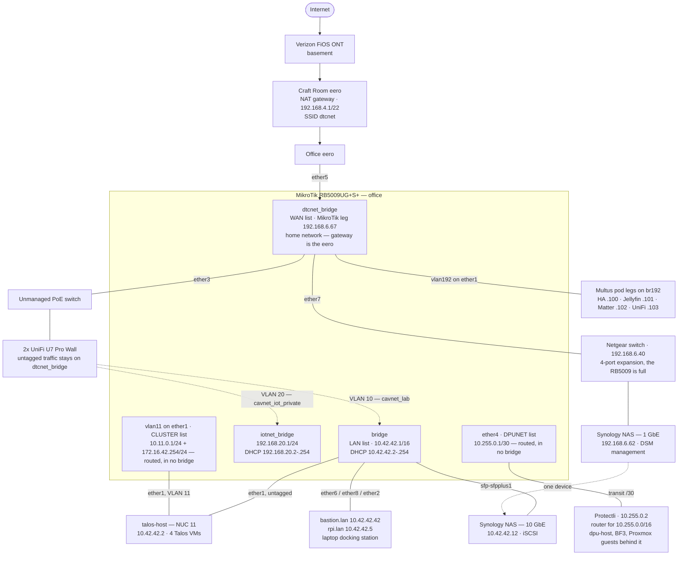
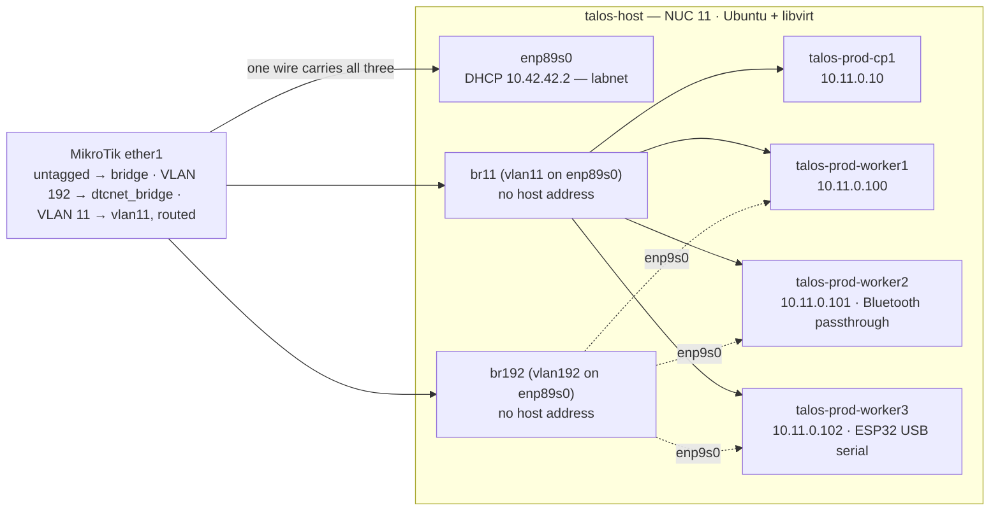
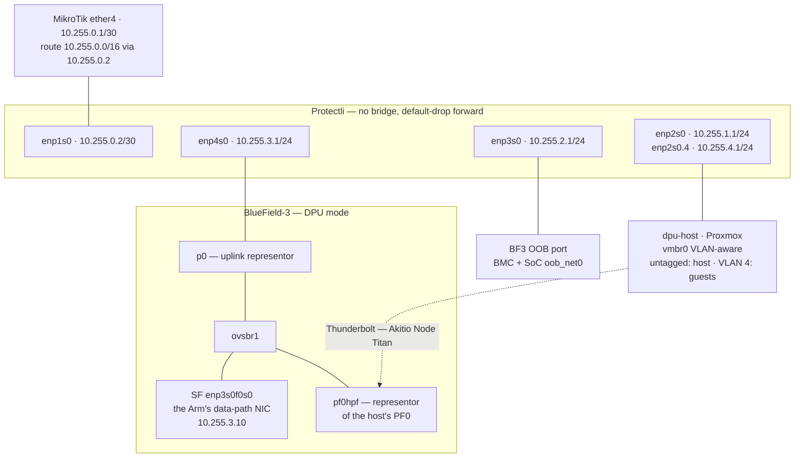
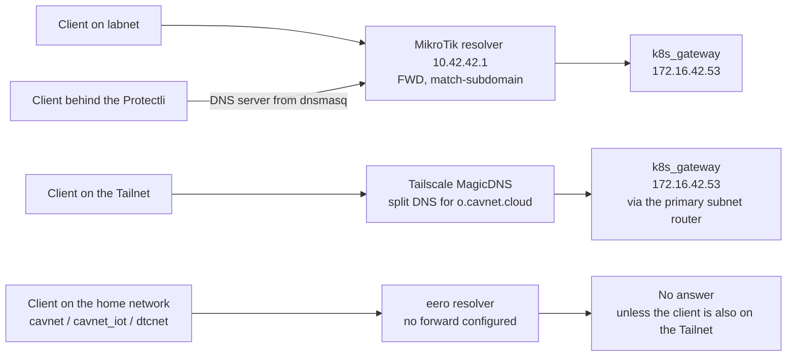

# Network architecture

Two parts. The sections up to [What is verified here](#what-is-verified-here-and-what-is-not)
describe the network as it runs on 2026-09-27, drawn from config rather than memory.
The section headed **Proposed** describes a design that has not been built.

These are architecture, not migration plans: they state the shape and the reasoning behind it.
Sequencing lives outside the repo. Work is tracked in DAN-24.

Read from: `mikrotik/config.rsc` (RouterOS export, 2026-09-27), the patches under
`k8s/talos/prod/patches/`, `k8s/talos/prod/README.md`, `k8s/talos/prod/cilium/`,
`ansible/host_vars/`, the `protectli`, `talos_host` and `tailscale` roles under
`ansible/roles/`, and the live systems. See
[What is verified here](#what-is-verified-here-and-what-is-not) at the end for the boundary.

## Networks

| Network | CIDR | Gateway | Lives on | Reachable from labnet |
| --- | --- | --- | --- | --- |
| home | `192.168.4.0/22` | `192.168.4.1` | Craft Room eero — its own NAT domain | Outbound only, via the MikroTik's masquerade |
| labnet | `10.42.0.0/16` | `10.42.42.1` | MikroTik `bridge` | — |
| IoT | `192.168.20.0/24` | `192.168.20.1` | MikroTik `iotnet_bridge` | Yes, connected route |
| Cluster nodes, VLAN 11 | `10.11.0.0/24` | `10.11.0.1` | MikroTik `vlan11` on `ether1`, routed | Yes, connected route |
| LoadBalancer | `172.16.42.0/24` | none | Cilium LB-IPAM; on-link on `vlan11` | Yes, connected route |
| Pod CIDR | `10.244.0.0/16` | none | Cilium, Talos default | No — unrouted |
| Service CIDR | `10.96.0.0/12` | none | Kubernetes, Talos default | No — unrouted |
| DPU transit | `10.255.0.0/30` | — | MikroTik `ether4` ↔ Protectli `enp1s0` | Yes, connected |
| Host management | `10.255.1.0/24` | `10.255.1.1` | Protectli `enp2s0` | Yes |
| DPU management | `10.255.2.0/24` | `10.255.2.1` | Protectli `enp3s0` | Yes; cluster to the SoC on TCP 80 |
| DPU data path | `10.255.3.0/24` | `10.255.3.1` | Protectli `enp4s0` | Yes |
| Proxmox guests | `10.255.4.0/24` | `10.255.4.1` | Protectli `enp2s0.4`, VLAN 4 | Yes |

The five `10.255` networks sit behind one MikroTik summary route, `10.255.0.0/16` via
`10.255.0.2`. The Protectli firewalls them; see [Inside the Protectli](#inside-the-protectli).

Versions: MikroTik RB5009UG+S+ on RouterOS 7.14.1; Talos v1.13.9; Kubernetes v1.36.4;
Cilium v1.20.1.

## Wired topology

The home network is the odd one out: the MikroTik is a *client* of it, not its gateway.



`ether3` is a member of `dtcnet_bridge`, so the APs' untagged traffic lands on the home
network, while their VLAN 10 and VLAN 20 tags are pulled off into the other two bridges.
The Synology is one device with legs in two domains: 10 GbE on labnet for iSCSI, NFS and the
DSM API, 1 GbE on the home network for home clients. `ether1` carries three networks to
talos-host: labnet untagged, VLAN 192 bridged into the home network, and VLAN 11 routed.

### MikroTik ports

| Port | Bridge | Attached |
| --- | --- | --- |
| `ether1` | `bridge`, plus `vlan192` → `dtcnet_bridge` and `vlan11`, routed | talos-host (NUC 11) |
| `ether2` | `bridge` | Laptop docking station |
| `ether3` | `dtcnet_bridge`, plus `vlan10` → `bridge` and `vlan20` → `iotnet_bridge` | PoE switch → 2× UniFi U7 Pro Wall |
| `ether4` | none — routed, `10.255.0.1/30`, list `DPUNET` | Protectli uplink (`enp1s0`, `10.255.0.2`) |
| `ether5` | `dtcnet_bridge` | Office eero — the uplink |
| `ether6` | `bridge` | RPi 4 — `bastion.lan` |
| `ether7` | `dtcnet_bridge` | Netgear switch — 4-port expansion; also carries the Synology's 1 GbE leg |
| `ether8` | `bridge` | RPi 5 — `rpi.lan` |
| `sfp-sfpplus1` | `bridge` | Synology NAS — 10 GbE |

### SSIDs

| SSID | Tag | Lands on | Notes |
| --- | --- | --- | --- |
| `dtcnet` | — | home | Hosted by the eeros. To be retired. |
| `cavnet` | untagged | home | UniFi. Intended replacement for `dtcnet`. |
| `cavnet_iot` | untagged | home | 2.4 GHz only. |
| `cavnet_lab` | VLAN 10 | labnet | |
| `cavnet_iot_private` | VLAN 20 | IoT | ESP32 devices. |

### Static reservations on the eero

| Address | Device |
| --- | --- |
| `192.168.5.208` | TP-Link Kasa KP303 — office strip feeding the BlueField-3, dpu-host and the MikroTik |
| `192.168.6.40` | Netgear switch management |
| `192.168.6.62` | Synology NAS — home network leg |
| `192.168.6.67` | MikroTik — home network leg |
| `192.168.6.100` | Home Assistant, Multus leg (MAC `1e:03:e4:b3:4f:47`, formerly worker2's) |
| `192.168.6.101` | Jellyfin, Multus leg |
| `192.168.6.102` | Matter server, Multus leg |
| `192.168.6.103` | UniFi controller, Multus leg |

## Inside talos-host

The NUC's one NIC carries three things. Untagged frames are labnet, where the host holds
`10.42.42.2` directly on `enp89s0`. VLAN 11 goes to `br11`, the cluster VLAN, where the host has no address —
not even IPv6 link-local — so the hypervisor has no presence in the VM network. VLAN 192 goes
to `br192` the same way, and each worker's `enp9s0` joins it untagged, with no address on the node. The MikroTik bridges
VLAN 192 into `dtcnet_bridge`. `ansible/roles/talos_host` renders the netplan.



The host reaches the cluster the way any labnet client does: through the MikroTik, out and back
on the same full-duplex cable. Node-to-node traffic is switched inside `br11` and never reaches
the router, so a MikroTik reboot cuts the cluster off without breaking it.

`br_netfilter` is loaded and `bridge-nf-call-iptables` and `bridge-nf-call-ip6tables` are both 1,
so untagged bridged VM frames traverse the host's `FORWARD` chain in both families, and both
policies must be ACCEPT. A DROP policy there stops all VM traffic on `br11` and `br192`. Docker
runs with `ip-forward-no-drop`, so it never sets DROP, and the `talos_host` role resets both
policies to ACCEPT. VLAN-tagged frames skip `FORWARD` (`bridge-nf-filter-vlan-tagged` is 0),
so a policy mistake shows up first on untagged traffic.

## Cluster network

The four Talos VMs sit on their own routed VLAN, VLAN 11, whose gateway is the MikroTik. The
MikroTik is the one place policy between the cluster and everything else is enforced. The
LoadBalancer network keeps its own subnet, `172.16.42.0/24`, as the cluster's published
surface. The pod and service CIDRs are not routed anywhere outside the cluster. Built on
2026-09-24 by renumbering the running cluster in place; it replaced a libvirt NAT network, see
[Before 2026-09-24](#before-2026-09-24-the-natd-cluster).

| Node | Address | NIC MAC |
| --- | --- | --- |
| `talos-prod-cp1` | `10.11.0.10/24` | `02:c0:77:b4:28:80` |
| `talos-prod-worker1` | `10.11.0.100/24` | `02:52:a7:0b:1d:89` |
| `talos-prod-worker2` | `10.11.0.101/24` | `de:6f:9f:0d:15:96` |
| `talos-prod-worker3` | `10.11.0.102/24` | `12:62:54:b1:2d:b0` |

`10.11.0.0/24` sits in a `10.11.0.0/16` reservation, outside labnet's `/16`, so shrinking labnet
later touches nothing here.

### How a LoadBalancer request reaches a pod

`CiliumL2AnnouncementPolicy` only works when the router ARPs for the LoadBalancer IP itself,
which it does only for destinations on-link on one of its interfaces. A static route makes it
ARP for the next hop instead, which is why `l2announcements` did nothing before the move.

The LoadBalancer subnet does not have to share the nodes' subnet to be on-link. The MikroTik
holds a second address, `172.16.42.254/24`, on `vlan11`, so the VLAN carries two subnets on
one broadcast domain. For `172.16.42.53`, the MikroTik ARPs on `vlan11`. Cilium on the node
holding that IP's lease answers with its MAC. If the node dies, another takes the lease and
answers the next ARP. The nodes need no address in `172.16.42.0/24`. Replies leave through
each node's default gateway, `10.11.0.1`, so the MikroTik sees both halves of every flow.

The router's address in that subnet exists to make the subnet connected and to source ARP.
Nothing uses it as a gateway. It sits at `.254` because `cilium-ingress` holds `.1`, and the
pool in `k8s/talos/prod/cilium/resources.yaml` is an explicit range that excludes it:

```yaml
blocks:
  - start: "172.16.42.1"
    stop: "172.16.42.253"
```

Cilium settings in `k8s/talos/prod/cilium/`:

- One `CiliumL2AnnouncementPolicy` with `loadBalancerIPs: true` for all services, and an
  `interfaces` regex matching only the VLAN 11 NIC, so no node answers ARP for a LoadBalancer
  IP on its homenet NIC.
- `devices` is `[enp1s0]`. Cilium never attaches to the homenet NICs, which carry pods' macvlan
  children; tc ingress runs before macvlan's receive handler, and NodePorts are not served there.
- `k8sClientRateLimit` at `qps: 10`, `burst: 20`. Each service holds a lease renewed every
  5 seconds, so 11 services cost 2.2 QPS against a default limit of 5 QPS that all other
  Cilium API traffic shares ([L2 Announcements](https://docs.cilium.io/en/stable/network/l2-announcements/)).
- `bpf.lbExternalClusterIP` is off, so ClusterIPs stay unreachable from outside the cluster
  even if a route to `10.96.0.0/12` reappears somewhere.

`externalTrafficPolicy: Local` is unsupported with L2 announcements. Nothing in `k8s/` sets it.

### LoadBalancer addresses in use

| Address | Service | Namespace |
| --- | --- | --- |
| `172.16.42.1` | `cilium-ingress` | `kube-system` |
| `172.16.42.2` | `mimir-http` | `monitoring` |
| `172.16.42.3` | `argocd-server` | `argocd` |
| `172.16.42.4` | `cilium-gateway-private-gateway` | `default` |
| `172.16.42.5` | `cilium-gateway-public-gateway` | `internet` |
| `172.16.42.6` | `loki-http` | `monitoring` |
| `172.16.42.7` | `matter-server` | `matter` |
| `172.16.42.8` | `firmware` | `firmware` |
| `172.16.42.9` | `flicd` | `flicd` |
| `172.16.42.12` | `mqtt` | `mosquitto` |
| `172.16.42.53` | `dns-gateway-k8s-gateway` | `dns-gateway` |

### Talos configuration

Addresses are static in machine config, not DHCP reservations. The node IP is etcd's peer
address and appears in kubelet and apiserver certificates; a lease expiring during a router
reboot should not also cost etcd its address. The cluster VLAN runs no DHCP server.

- A per-node patch for each of the four nodes, holding its interface — selected by MAC, its
  address, and a default route via `10.11.0.1` — and its hostname. libvirt's DHCP supplied the
  hostnames before the move, and local-path PVs are pinned to them. The hostname uses
  `machine.network.hostname`, because the v1.9-contract configs set
  `machine.features.stableHostname`, which rejects a `HostnameConfig` document.
- `common.patch.yaml`: `nameservers` is `10.11.0.1`, the router's address on the nodes'
  own subnet, so DNS does not depend on labnet's addressing. `kubelet.nodeIP.validSubnets`
  is `10.11.0.0/24`.
- `cp.patch.yaml`: `etcd.advertisedSubnets` is `10.11.0.0/24`.

Patches layer `common` → `cp` or `worker-common` → the optional role patches
(`worker-bluetooth`, `worker-esp32`, `oidc`) → the node patch.

`worker-common.patch.yaml` also brings up any NIC with MAC `02:d7:c0:00:0b:*` with no address
and IPv6 disabled. Each worker's homenet NIC sits on libvirt PCI bus 9, so it is `enp9s0`
everywhere.

The control-plane endpoint is `https://k8s.cavnet.cloud:6443`, on every node; it is in
`certSANs`, talosconfig and the kubeconfig. Its Route53 A record holds `10.11.0.10`: a private
address in public DNS, because the name must resolve from labnet, the Tailnet and inside the
cluster, and Route53 is the resolver all three share. The MikroTik also holds a static entry
for it, so nodes find the API server during an internet outage; the two must change together. A Talos VIP would add nothing with one
control-plane node.

Configs render from the age-encrypted secrets bundle,
`k8s/talos/prod/talos-prod-secrets.yaml.age`, with `talosctl gen config --with-secrets …
--talos-version v1.9`. The v1.9 contract is how the cluster was first generated; rendering with
it reproduces the live configs exactly. See `k8s/talos/prod/README.md`.

### Homenet legs

HA, Matter, UniFi and Jellyfin need the homenet's L2: mDNS and SSDP, HomeKit, the HomePod's
router advertisements for Thread, UniFi AP inform, TVs. Each gets a second interface, `net1`,
from Multus (thick plugin, `k8s/manifests/multus/`). A NetworkAttachmentDefinition named `home`
in the workload's namespace makes `net1` a macvlan child of the node's `enp9s0`, with a static
address and a MAC pinned in the macvlan plugin, each reserved on the eero. `net1` carries the
connected `/22`; the default route stays on Cilium's `eth0`. Every leg takes a SLAAC address
from the homenet's router advertisements, which carry no IPv6 default route. Only Matter's
attachment also accepts their route information (`tuning` sets `accept_ra=2` and
`accept_ra_rt_info_max_plen=64`), for the Thread routes.

No node holds a homenet address, so home devices cannot reach NodePorts, pods or ClusterIPs
through a node. Cilium does not see `net1`, so network policy does not cover it; the four pods
are on the homenet by design. Talos ships no `macvlan`, `static` or `tuning` plugin; an init
container in the Multus DaemonSet installs them from the pinned `containernetworking/plugins`
release after checking its SHA-256. flicd stays on `hostNetwork` on worker2: the kernel refuses
`AF_BLUETOOTH` sockets outside the initial network namespace.

A home-leg pod's peers in the cluster must use a Service, not `localhost`: HA reaches Matter at
`matter-server.matter.svc.cluster.local` and flicd at `flicd.flicd.svc.cluster.local`.

### The cluster zone on the MikroTik

The LoadBalancer range is the published surface. Node IPs are reachable only for
administration, from labnet and the Tailnet. The block goes after the `DPUNET` rules and ends in explicit
drops, because RouterOS accepts what falls off the end of a chain.

```
/interface vlan
add interface=ether1 name=vlan11 vlan-id=11 comment="talos-host -> cluster nodes, routed"
/interface list
add name=CLUSTER comment="Kubernetes node VLAN"
/interface list member
add interface=vlan11 list=CLUSTER
/ip address
add address=10.11.0.1/24 interface=vlan11
add address=172.16.42.254/24 interface=vlan11 comment="Makes the LB subnet on-link for L2 announcements"
/ip firewall address-list
add address=10.42.42.0/24 list=cluster-admins comment="Labnet (including SNATed Tailscale traffic)"
/ip firewall filter
add chain=input action=accept in-interface-list=CLUSTER protocol=udp dst-port=53 comment="CLUSTER: DNS"
add chain=input action=accept in-interface-list=CLUSTER protocol=tcp dst-port=53 comment="CLUSTER: DNS"
# forward, after the DPUNET block
add chain=forward action=accept in-interface-list=LAN dst-address=172.16.42.0/24 comment="labnet -> LBs"
add chain=forward action=accept in-interface=iotnet_bridge dst-address=172.16.42.0/24 comment="IoT -> LBs"
add chain=forward action=accept src-address-list=cluster-admins dst-address=10.11.0.10 protocol=tcp dst-port=6443 comment="admins -> kube-apiserver"
add chain=forward action=accept src-address-list=cluster-admins dst-address=10.11.0.0/24 protocol=tcp dst-port=50000 comment="admins -> Talos API"
add chain=forward action=accept in-interface-list=LAN out-interface-list=CLUSTER protocol=icmp comment="labnet -> nodes: ping"
add chain=forward action=accept in-interface-list=CLUSTER out-interface-list=WAN dst-address-list=!private comment="CLUSTER: internet"
add chain=forward action=accept in-interface-list=CLUSTER dst-address=10.42.42.12 comment="CLUSTER: NAS - iSCSI, NFS, DSM"
add chain=forward action=accept in-interface-list=CLUSTER dst-address=10.42.42.5 protocol=tcp dst-port=3493 comment="CLUSTER: NUT on rpi.lan"
add chain=forward action=accept in-interface-list=CLUSTER dst-address=10.42.42.0/24 protocol=tcp dst-port=3470 comment="CLUSTER: Defakto http_dns attestation callback"
add chain=forward action=drop in-interface-list=CLUSTER log=yes log-prefix="[cluster-out]" comment="CLUSTER: log and drop rest"
add chain=forward action=drop out-interface-list=CLUSTER log=yes log-prefix="[cluster-in]" comment="-> CLUSTER: log and drop rest"
```

- **The last two rules drop and log.** The outbound allow list came from the addresses
  hard-coded in `k8s/manifests`; Home Assistant's integrations live in its UI and may reach
  hosts the repo does not show, so `/log print where message~"cluster-"` is where a missing
  rule shows up. A short logging-only period on 2026-09-24 surfaced one such flow: the SPIRL
  server calling host agents back.
- **The Defakto callback** is the `http_dns` attestor: the SPIRL server in the cluster connects
  to each host agent's advertised port to verify it (`agent-config.yaml.j2`, `compose.yaml.j2`).
  It is open to all of labnet, so a new host with `enable_spiffe` needs no rule. The BF3's
  callback, to `dpu.lan:80`, is a `DPUNET` rule instead.
- **The NAS rule allows every port.** NFSv3 needs portmapper and mountd besides 2049, and the
  NAS is already a trusted dependency; narrowing its ports buys little.
- **`DPUNET` rules match first.** Its rule admitting TCP 80 and 443 to `172.16.42.0/24`, and
  `CLUSTER -> DPUNET guests` and the BF3's attestation callback, sit before this block. Other cluster traffic to `DPUNET` is
  dropped by `-> DPUNET: drop rest`; see [Exposing guest services](#exposing-guest-services).
- **Traffic that never reaches the router:** node to node, switched inside `br11`; a node or
  pod reaching a LoadBalancer IP, handled by Cilium's socket LB; and the pods' homenet legs,
  which are bridged into `dtcnet_bridge` through `br192`, not routed.
- **NAT:** internet-bound traffic leaves through the defconf masquerade. Traffic to labnet
  keeps its `10.11.0.x` source.

`vlan11` is routed: its addresses sit on the VLAN interface and it belongs to no bridge, like
`ether4`. Bridged into `bridge`, it would put the nodes on labnet's L2 and recreate the
unfiltered boundary.

### Tailscale

`ansible/roles/tailscale` holds the complete Tailscale settings for rpi, bastion, talos-host and
the Protectli. When a host's settings drift — anything set by hand, managed or not — it runs
`tailscale up --reset` with every managed flag, which returns everything else to its default.

| Hosts | Advertises | Exit node | Tailscale SSH | Accepts DNS |
| --- | --- | --- | --- | --- |
| rpi, bastion, talos-host | `10.42.0.0/16`, `10.11.0.0/16`, `172.16.42.0/24`, `10.255.0.0/16` | Yes | Yes | No |
| Protectli | nothing | Yes | Yes | No |

The three subnet routers share the routes; `rpi.lan` is primary at the time of writing, so
Tailnet clients reach labnet and the cluster SNAT'd as `10.42.42.5`. The Tailnet is an extension
of labnet by design. Both admin sets, `cluster-admins` on the MikroTik and
`protectli_admin_hosts`, are `10.42.42.0/24`, which holds every labnet host and that SNAT
address, so no policy needs to tell a Tailnet client from a labnet host. The Protectli
advertises no subnets because `DPUNET` cannot reach labnet or the cluster; as a failover router
for them it would break the Tailnet's access.

Accepting DNS is off everywhere. With it on, `systemd-resolved` sends `~o.cavnet.cloud` to
MagicDNS, which queries `172.16.42.53:53` directly from the host — a query `DPUNET` drops on the
Protectli, since it admits only TCP 80 and 443 to the LoadBalancers.

### Not built

- **Port policy between control plane and workers.** A separate control-plane VLAN would make
  every node-to-control-plane packet depend on the MikroTik. The Talos ingress firewall
  (`NetworkDefaultActionConfig`, `NetworkRuleConfig`) or Cilium's host firewall enforces the
  same thing on each node.

## Inside the Protectli

The Protectli (Ubuntu 24.04, four 1 GbE ports) routes a segment for the BlueField-3 DPU and
`dpu-host`. The DPU is treated as trusted networking infrastructure and the host as an
untrusted carrier of workloads. `terraform/defakto/main.tf` attests the BF3 against a pinned
TPM EK hash, which the host cannot forge, and also requires an `http_dns` callback to
`dpu.lan:80`. The network's job is to stop the
host reaching the DPU's management plane. Everything below is rendered by
`ansible/roles/protectli` from `ansible/host_vars/protectli.lan.yaml`.

| Port | Address | Segment | Attached | Addressing |
| --- | --- | --- | --- | --- |
| `enp1s0` | `10.255.0.2/30` | Transit | MikroTik `ether4` | Static |
| `enp2s0` | `10.255.1.1/24` | Host management | `dpu-host` `vmbr0`, untagged | Reservation `.10` |
| `enp2s0.4` | `10.255.4.1/24` | Proxmox guests, VLAN 4 | Guests with `tag=4` (`cletus` at `.20`) | Pool `.100`–`.199` plus reservations |
| `enp3s0` | `10.255.2.1/24` | DPU management | BF3 BMC (`.10`) and SoC `oob_net0` (`.11`) — two MACs, one wire | Reservations |
| `enp4s0` | `10.255.3.1/24` | DPU data path | BF3 P0 | Reservation `.10`, no default route |



In DPU mode the card's ConnectX is a switch programmed from the Arm through OVS. `p0` is the
physical port as a switch port, not an endpoint. The endpoints on the data path are the Arm's
scalable function (`enp3s0f0s0`) and, later, the host's PF0 behind `pf0hpf`. `ovsbr2` does the
same for `p1`, which is not cabled. The SF gets no default route, so the SoC's own egress stays
on `oob_net0`.

### Why each segment is separate

Host management and DPU management are different subnets because ARP is not a boundary.
Putting the host's NIC on the same L2 as the DPU's management interfaces would make it
adjacent to the management plane of the device that polices it. Routing puts the Protectli in
the path, where a rule can refuse it.

The uplink is a two-host transit subnet, outside labnet's `/16`. Had the Protectli stayed on
labnet, it would hold a connected route to `10.42.0.0/16`. Replies to labnet would then skip
the MikroTik, which is the asymmetry described under
[Before 2026-09-24](#before-2026-09-24-the-natd-cluster).

The guest VLAN is applied by Proxmox, so guest isolation is only as strong as the host. That
fits the trust model: a compromised host owns its guests anyway, and the boundary that must
hold against the host is DPU management, which is a separate physical port.

### Firewall

Two layers. The MikroTik treats `10.255.0.0/16` as one zone (`DPUNET`) and protects labnet from
it. The Protectli enforces per-segment rules in its own nftables table, `inet router`.

Protectli forward policy, new connections (established and related are always accepted):

| From ↓ / To → | Host mgmt | DPU mgmt | Data path | Guests | DNS `10.42.42.1:53` | Cluster LBs `:443` | Other RFC 1918 | Internet |
| --- | --- | --- | --- | --- | --- | --- | --- | --- |
| Labnet or Tailnet, via uplink | ✓ | ✓ | ✓ | ✓ | — | — | — | — |
| Cluster nodes, via uplink | ✗ | SoC TCP 80 | ✓ | ✓ | — | — | — | — |
| `dpu-host` | — | ✗ | ✗ | ✗ | ✓ | ✗ | ✗ | ✓ |
| BF3 SoC `10.255.2.11` | ✗ | — | ✗ | ✗ | ✓ | ✓ | ✗ | ✓ |
| BF3 BMC `10.255.2.10` | ✗ | ✗ | ✗ | ✗ | ✗ | ✗ | ✗ | ✗ |
| Data path | ✗ | ✗ | — | ✗ | ✓ | ✗ | ✗ | ✓ |
| Guests | ✗ | ✗ | ✗ | — | ✓ | ✗ | ✗ | ✓ |
| `tailscale0` (exit node) | ✗ | ✗ | ✗ | ✗ | ✓ | ✓ | ✗ | ✓ |

The admin set, `protectli_admin_hosts`, is `10.42.42.0/24`, where every labnet host lives. Tailnet clients arrive SNAT'd as the
primary subnet router, so they count as labnet. Cluster traffic arrives as a node's `10.11.0.x`,
outside that set, and reaches only the open segments and TCP 80 on the BF3 SoC for Defakto's
`http_dns` callback. The MikroTik narrows it further, passing only TCP to the guest VLAN and
that callback; everything else is dropped by `-> DPUNET: drop rest`.
Exit-node traffic to other private ranges leaves as `10.255.0.2` and is dropped by the
MikroTik's zone rules.

Details that are easy to break:

- **Docker** runs with `"ip-forward-no-drop": true`, so it no longer sets `FORWARD` to DROP.
  Every Docker DROP is scoped to its own bridges, and a drop in any table is final, so Docker
  can add drops but never open the router.
- **`nftables.service`** ships with `ExecStop=nft flush ruleset`, which would delete Docker's
  and Tailscale's tables. A drop-in replaces it with `nft destroy table inet router`, and
  `/etc/nftables.conf` replaces only its own table.
- **The input chain** is policy accept, with explicit drops from the downstream ports, so a
  mistake there cannot cut off SSH over the uplink or Tailscale.
- **Router advertisements** are ignored on the downstream ports (`accept-ra: false`), so an
  untrusted segment cannot become the Protectli's IPv6 gateway.

MikroTik `DPUNET` rules: the segment may reach the internet (non-RFC 1918 destinations only,
which keeps it off the home network), the LoadBalancers on TCP 80 and 443, and the MikroTik's
DNS. Labnet may initiate into it, and the Protectli applies the per-source rules. The cluster
may initiate TCP to the guest VLAN, `10.255.4.0/24`, and to `dpu.lan:80` for the BF3's attestation
callback, and nowhere else in the segment. Everything
else in or out of `DPUNET` is dropped explicitly, because RouterOS accepts what falls off the
end of a chain.

### DHCP

dnsmasq on the Protectli serves DHCP only (`port=0`), and hands out `10.42.42.1` as the DNS
server, so the MikroTik stays the one resolver and the one authority for `*.lan`. `port=0`
must be in `/etc/dnsmasq.conf` itself. Debian's start hook greps that file for it before
registering `127.0.0.1` as the host's resolver. Every segment leases only to reserved MACs
except the guest VLAN, which also has a pool.

### Exposing guest services

HTTP services in Proxmox guests are published as `*.o.cavnet.cloud` names through the
cluster's private gateway, not through a second ingress. `k8s/manifests/dpu-host/` holds one
file per service: a selectorless Service, a hand-written EndpointSlice with the guest's
address, and an HTTPRoute on `private-gateway`. The route inherits the wildcard certificate,
DNS from k8s_gateway, and reachability from labnet, IoT and the Tailnet. The first is
`llama.o.cavnet.cloud`, llama.cpp's web UI on `cletus` (`10.255.4.20:8080`).

The gateway's Envoy runs on every node, so requests leave from whichever node's `10.11.0.x`
address handles them. The MikroTik rule `CLUSTER -> DPUNET guests` admits TCP from the node
VLAN to `10.255.4.0/24`, any port, so a new service needs no router change. The Protectli
needs no rule: the guest segment's `open_to_labnet` accepts any source arriving on the uplink.

A new service needs a DHCP reservation in `ansible/host_vars/protectli.lan.yaml`, because the
EndpointSlice pins its address, and one more file in `k8s/manifests/dpu-host/`. The services
have no authentication of their own; anything that can reach the private gateway can use them.

## Where `*.o.cavnet.cloud` resolves

Four client locations. Three reach the same answer by different paths; the home network
gets none.



Nodes and pods resolve through the Talos nameserver `10.11.0.1`
(`k8s/talos/prod/patches/common.patch.yaml`), the MikroTik's address on the cluster VLAN — the
same forward as the first row.

The subnet routers and the Protectli do not accept Tailscale DNS, so they resolve through the
MikroTik too; see [Tailscale](#tailscale).

## What crosses the boundary today

| From | To | For | Defined in |
| --- | --- | --- | --- |
| Cluster | `10.42.42.12` | iSCSI, NFS and the DSM API over 10 GbE; `nas.o.cavnet.cloud` | `k8s/manifests/synology-csi/dsm-proxy.yaml`, `k8s/manifests/jellyfin/jellyfin.yaml` |
| Cluster | `10.42.42.5:3493` | NUT, for UPS metrics | `k8s/manifests/nut-exporter/exporter.yaml` |
| Cluster | labnet `:3470` | Defakto `http_dns` attestation callback to host agents | `ansible/roles/docker/templates/docker/defakto/agent-config.yaml.j2` |
| Cluster | `10.255.2.11:80` | Defakto `http_dns` attestation callback to the BF3's agent | `ansible/roles/dpu/templates/agent-config.yaml.j2`, `mikrotik/config.rsc`, `ansible/roles/protectli/templates/nftables.conf.j2` |
| Cluster | Internet | Images, ACME, the Cloudflare tunnel, AWS | `mikrotik/config.rsc` (`CLUSTER: internet`) |
| Nodes and pods | `10.11.0.1:53` | DNS for `*.o.cavnet.cloud` and `*.lan` | `k8s/talos/prod/patches/common.patch.yaml` |
| Labnet, IoT, Tailnet | `172.16.42.0/24` | Cluster services | `mikrotik/config.rsc` |
| Labnet and Tailnet | `10.11.0.10:6443`, nodes `:50000` | `kubectl`, `talosctl` | `mikrotik/config.rsc` (`cluster-admins`) |
| Cluster | `10.255.4.0/24`, TCP | HTTP services in Proxmox guests, e.g. `llama.o.cavnet.cloud` | `k8s/manifests/dpu-host/`, `mikrotik/config.rsc` |
| rpi, bastion | `mimir`, `loki` on `:443` | Alloy, native SPIFFE mTLS (`enable_spiffe`) | `ansible/roles/docker/templates/docker/alloy/config.alloy.j2` |
| Homenet devices | `192.168.6.100` | Home Assistant: UI, HomeKit bridge, emulated_hue, mDNS and SSDP | `k8s/manifests/home-assistant/home-network.yaml` |
| Homenet TVs | `192.168.6.101:8096` | Jellyfin | `k8s/manifests/jellyfin/home-network.yaml` |
| HomePod Thread border router | `192.168.6.102` (`net1`) | ICMPv6 route advertisements for Matter | `k8s/manifests/matter/home-network.yaml` |
| UniFi APs | `192.168.6.103:8080` | Controller inform | `k8s/manifests/unifi/home-network.yaml` |
| MikroTik resolver | `172.16.42.53` | `o.cavnet.cloud` forward | `mikrotik/config.rsc` |
| Route53 | `10.11.0.10` | `k8s.cavnet.cloud` A record | AWS, outside this repo |
| Everything behind the Protectli | `10.42.42.1:53` | DNS | `ansible/roles/protectli/templates/`, `mikrotik/config.rsc` |
| BF3 SoC `10.255.2.11` | `172.16.42.0/24:443` | Cluster services, including Alloy to `mimir` and `loki` with native SPIFFE mTLS | `ansible/roles/protectli/templates/nftables.conf.j2`, `ansible/roles/dpu/files/config.alloy` |
| talos-host, Protectli host | `mimir`, `loki` on `:80` | Alloy, plain HTTP (no `enable_spiffe`) | `ansible/roles/docker/templates/docker/alloy/config.alloy.j2` |
| Tailnet | `10.42.0.0/16`, `10.11.0.0/16`, `172.16.42.0/24`, `10.255.0.0/16` | Subnet routes via rpi, bastion or talos-host | `ansible/roles/tailscale` |

## Known gaps

- **IoT can initiate into labnet.** `iotnet_bridge` belongs to neither `LAN` nor `WAN`, and
  RouterOS accepts what falls off the end of the forward chain.
- **`DPUNET` reaches every LoadBalancer on 80 and 443.** Tighten to specific addresses once
  the segment's cluster dependencies settle.
- **The BF3's own firewall is inert.** The image's `/etc/iptables/rules.v4` marks `oob_net0`
  traffic in a filter-table chain named `PREROUTING`, which has no hook and no jump, so none of
  its `mark 0xb` drops ever match (verified 2026-09-27 by zero counters). The Protectli is the
  only filter in front of the SoC.
- **The Protectli fails open at boot.** If `nftables.service` fails, the kernel forwards
  between segments unfiltered. The ruleset is validated with `nft -c` before install and loads
  atomically.
- **Workers DHCP on the homenet for about a second at boot.** Talos's early networking runs
  DHCP on `enp9s0` before the machine config claims it (observed 2026-09-27: 1.1 s, with a
  default route via `192.168.4.1`). It ends before kubelet and Cilium start, and it leaves an
  eero lease per worker MAC.
- **Homenet pods can come up without their leg after an unattended reboot.** Multus's thick
  daemon deletes `00-multus.conf` when it exits, and kubelet restarts pods at boot before the new
  Multus pod rewrites it; a sandbox created in that window gets Cilium only, with no `net1`
  (observed 2026-09-27 after a talos-host reboot, about 4 minutes). A user-provided
  `multusConfigFile` is no fix in v4.3.1: the daemon exits at once in that mode. Alloy on
  `rpi.lan` TCP-probes each leg (`ansible/host_vars/rpi.lan.yaml`), and the `homenet-legs` group
  in `k8s/manifests/monitoring/alerts/home.yaml` alerts after 5 minutes without an answer.
  Recovery: `kubectl delete pod` on any homenet pod whose `ip addr` lacks `net1`.
- **The data-path SF's MAC may not survive a reimage.** `02:90:ef:4f:75:ed` is locally
  administered. If it changes, `dpu-p0`'s reservation stops matching.

## What is verified here, and what is not

Read from config or the live system:

- **MikroTik** — the RouterOS export at `mikrotik/config.rsc`, exported 2026-09-27; the ARP
  table, with every LoadBalancer IP on `vlan11` at a node's MAC; and the connection table.
- **Talos** — all patches under `k8s/talos/prod/patches/`, and all four node configs rendered
  from the secrets bundle and diffed against the live configs before the move.
- **Cilium** — `k8s/talos/prod/cilium/values.yaml` and `resources.yaml`.
- **Live cluster** — after the move: four nodes `Ready` under their old names on `10.11.0.x`,
  LoadBalancer IPs and PV node pins unchanged, one L2 lease per LoadBalancer service.
- **talos-host** — its netplan, bridges, and `FORWARD` policy, read over SSH.
- **Tailscale** — the settings of all four hosts, read with `tailscale debug prefs`.
- **Reachability** — `dig` and `curl` against LoadBalancer IPs from labnet.
- **Homenet legs** — probed on 2026-09-27 from a Mac on the home Wi-Fi, each deny paired with
  an allow of the same target from a pod in the cluster. HA answers on `192.168.6.100:8123` and
  Jellyfin on `192.168.6.101:8096`; a former NodePort on `.100` is refused; a pod IP and a
  ClusterIP stay unreachable through a static route via `.100`. HomeKit's `_hap._tcp` record
  and emulated_hue's `URLBase` resolve to `.100`, and Matter's `net1` holds the Thread route
  from the HomePod. Demo legs behaved the same on worker1 and worker3. Drained worker reboots
  kept every leg; an undrained talos-host reboot did not, see [Known gaps](#known-gaps).
- **Protectli segment** — the forward matrix probed on 2026-09-23 from a laptop in the admin
  set, from `rpi.lan`, and from `dpu-host`. Every deny was paired with an allow of the same
  target from an admin host, so a closed port can't pass for a drop. On 2026-09-24 the admin set
  widened to all of `10.42.42.0/24`; the matrix has not been probed since.
- **Guest services** — probed on 2026-09-27 from a pod: `10.255.4.20:8080` timed out before
  `CLUSTER -> DPUNET guests` and answered after it, while `dpu-host`'s `:8006` and the BF3
  SoC's `:22` stayed dropped and answered the laptop. `llama.o.cavnet.cloud` served the UI
  from labnet, and a 196-second streamed generation through the gateway completed.

Taken on report, not inspected:

- **Both eeros.** Addressing, SSID config and reservations come from the DAN-24
  description, not from the devices; the `.101`–`.103` reservations from direct report,
  2026-09-27.
- **The UniFi controller.** SSID-to-VLAN mapping is as described in the ticket; the
  controller's own config was not read.
- **The Tailscale admin console.** Route approvals and MagicDNS split DNS.
- **The Synology.** Its NFS allowlists (`10.42.42.0/24` and `10.11.0.0/24`) and its 1 GbE leg on
  the Netgear switch, recorded from direct report.
- **The BF3's internal switch.** Which OVS bridge holds which port lives on the DPU, not in
  this repo. See [Inside the Protectli](#inside-the-protectli).

## Before 2026-09-24: the NAT'd cluster

Until 2026-09-24 the VMs sat on a libvirt NAT network, `192.168.42.0/24`, and cp1 had a second
NIC on labnet, `10.42.42.100`, which made it the cluster's router. The MikroTik sent
`172.16.42.0/24`, `10.96.0.0/12` and `192.168.42.0/24` to cp1 by static route; cp1's replies
to labnet were on-link and skipped the router, so conntrack saw half of every flow and three
`notrack` rules kept it from dropping them. Every LoadBalancer service depended on cp1, and the
boundary could not be filtered statefully. `l2announcements` was enabled with no policy, so it
did nothing — `172.16.42.0/24` had never been on-link for any client.

Eight pieces of configuration existed only for that arrangement:

| # | Item | Now |
| --- | --- | --- |
| 1 | cp1's second NIC, `10.42.42.100/16` | Removed |
| 2 | cp1's metric-1 default route | Removed; every node's only default route is `10.11.0.1` |
| 3 | etcd pinned to `192.168.42.0/24` | Pinned to `10.11.0.0/24`, now the only subnet |
| 4 | kubelet pinned to `192.168.42.0/24` | Pinned to `10.11.0.0/24` |
| 5 | Three static routes via `10.42.42.100` | Removed; both subnets are connected |
| 6 | Three `notrack` rules | Removed; flows are symmetric |
| 7 | Two netplan routes on talos-host | Removed |
| 8 | Route53 record holding a private address | Kept, value `10.11.0.10`; it was never caused by NAT |


## Proposed — workloads behind the DPU

**Not implemented.** The segment in [Inside the Protectli](#inside-the-protectli) exists;
workloads on it do not. `cletus` runs on the guest VLAN, which the host enforces, not behind
the DPU.

### What is open

Whether workloads reach the data path through the host's PF0 (behind `pf0hpf` in `ovsbr1`),
through DPU-managed virtual interfaces, or through an overlay is not decided. With one DPU and
one host there is no fabric to span, so the Protectli is designed not to care: `10.255.3.0/24`
is plain routed transport either way, and a VTEP subnet can be added later without touching
the router. PF0 currently fails to probe on `dpu-host` (`mlx5_core ... error -110`); PF1
probes.

### Exposing workloads

Reuse [Exposing guest services](#exposing-guest-services), which is built for the guest VLAN.
A workload on the data path subnet takes the same Service, EndpointSlice and HTTPRoute, plus a
MikroTik rule admitting `CLUSTER` to `10.255.3.0/24`; the Protectli already admits it, since
the data path segment is also `open_to_labnet`. The cost is path length: every request crosses
the cluster.

### Constraints worth knowing

A B3220's ports are 200GbE class and a Protectli port is not, so workload traffic is capped
at 1 Gb. Fine for a chat stream, painful for pulling model weights off the NAS. The answer
if it bites is not a bigger Protectli — it is the SFP+ ports on a future basement router,
giving P1 a path that skips this box entirely.

The Thunderbolt link is a second ceiling. It trains at PCIe x1, 2.5 GT/s (2 Gb/s), and the
kernel reports insufficient slot power (27 W).

The Protectli is full: transit, host management, DPU management and P0 use all four ports.
