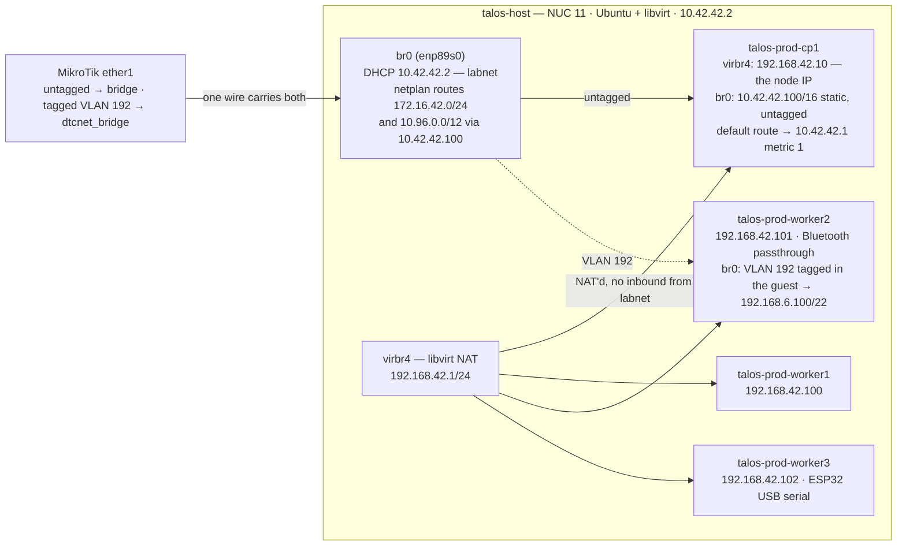
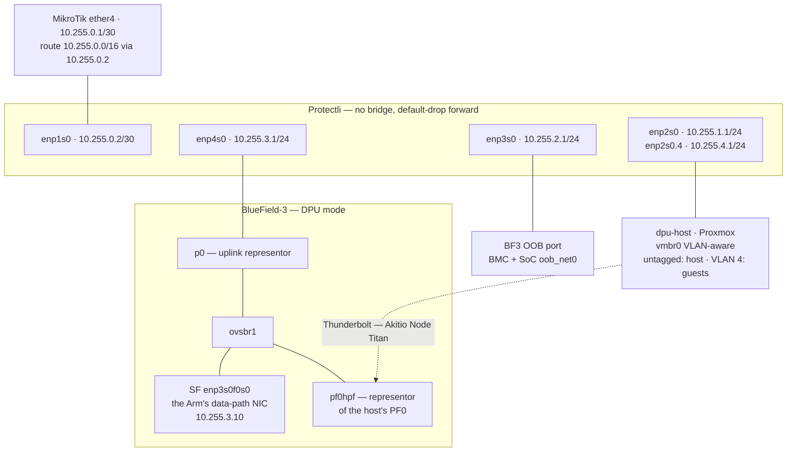
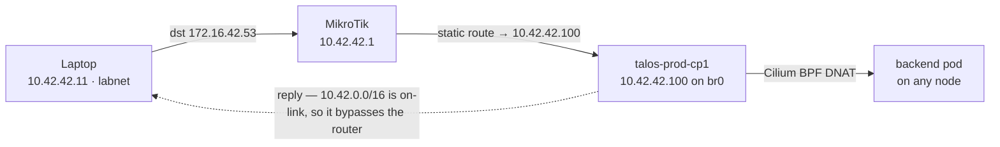
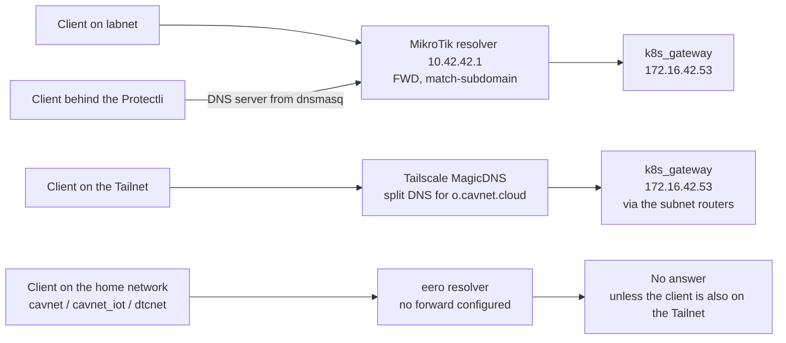
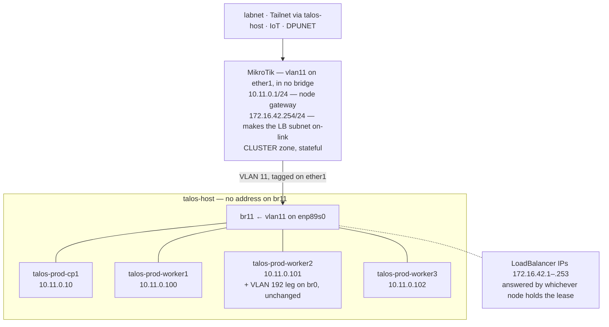

# Network architecture

Two parts. The sections up to [What is verified here](#what-is-verified-here-and-what-is-not)
describe the network as it runs on 2026-09-23, drawn from config rather than memory.
The sections headed **Proposed** describe designs that have not been built.

These are architecture, not migration plans: they state the target shape and the reasoning
behind it. Sequencing lives outside the repo. Work is tracked in DAN-24.

Read from: `mikrotik/config.rsc` (RouterOS export, 2026-09-23), the patches under
`k8s/talos/prod/patches/`, `k8s/talos/prod/README.md`, `k8s/talos/prod/cilium/`,
`ansible/host_vars/protectli.lan.yaml` and `ansible/roles/protectli/`, and the live systems. See [What is verified here](#what-is-verified-here-and-what-is-not) at the
end for the boundary.

## Networks

| Network | CIDR | Gateway | Lives on | Reachable from labnet |
| --- | --- | --- | --- | --- |
| home | `192.168.4.0/22` | `192.168.4.1` | Craft Room eero — its own NAT domain | Outbound only, via the MikroTik's masquerade |
| labnet | `10.42.0.0/16` | `10.42.42.1` | MikroTik `bridge` | — |
| IoT | `192.168.20.0/24` | `192.168.20.1` | MikroTik `iotnet_bridge` | Yes, connected route |
| Talos VMs | `192.168.42.0/24` | `192.168.42.1` | libvirt `virbr4` on talos-host | Yes, static route via `10.42.42.100` |
| LoadBalancer | `172.16.42.0/24` | none | Cilium LB-IPAM | Yes, static route via `10.42.42.100` |
| Service CIDR | `10.96.0.0/12` | none | Kubernetes | Yes, static route via `10.42.42.100` |
| DPU transit | `10.255.0.0/30` | — | MikroTik `ether4` ↔ Protectli `enp1s0` | Yes, connected |
| Host management | `10.255.1.0/24` | `10.255.1.1` | Protectli `enp2s0` | Admin hosts only |
| DPU management | `10.255.2.0/24` | `10.255.2.1` | Protectli `enp3s0` | Admin hosts only |
| DPU data path | `10.255.3.0/24` | `10.255.3.1` | Protectli `enp4s0` | Yes |
| Proxmox guests | `10.255.4.0/24` | `10.255.4.1` | Protectli `enp2s0.4`, VLAN 4 | Yes |

The five `10.255` networks sit behind one MikroTik summary route, `10.255.0.0/16` via
`10.255.0.2`. The Protectli firewalls them; see [Inside the Protectli](#inside-the-protectli).

Versions: MikroTik RB5009UG+S+ on RouterOS 7.14.1; Talos v1.13.9; Kubernetes v1.36.4;
Cilium v1.20.1.

## Wired topology

The home network is the odd one out: the MikroTik is a *client* of it, not its gateway.


`ether3` is a member of `dtcnet_bridge`, so the APs' untagged traffic lands on the home
network, while their VLAN 10 and VLAN 20 tags are pulled off into the other two bridges.
The Synology is one device with legs in two domains: 10 GbE on labnet for iSCSI, 1 GbE on
the home network for DSM management.

### MikroTik ports

| Port | Bridge | Attached |
| --- | --- | --- |
| `ether1` | `bridge`, plus `vlan192` → `dtcnet_bridge` | talos-host (NUC 11) |
| `ether2` | `bridge` | Laptop docking station |
| `ether3` | `dtcnet_bridge`, plus `vlan10` → `bridge` and `vlan20` → `iotnet_bridge` | PoE switch → 2× UniFi U7 Pro Wall |
| `ether4` | none — routed, `10.255.0.1/30`, list `DPUNET` | Protectli uplink (`enp1s0`, `10.255.0.2`) |
| `ether5` | `dtcnet_bridge` | Office eero — the uplink |
| `ether6` | `bridge` | RPi 4 — `bastion.lan` |
| `ether7` | `dtcnet_bridge` | Netgear switch — 4-port expansion; also carries the Synology's 1 GbE leg |
| `ether8` | `bridge` | RPi 5 — `rpi.lan` |
| `sfp-sfpplus1` | `bridge` | Synology NAS — 10 GbE |

### SSIDs

| SSID | Tag | Lands on | Notes |
| --- | --- | --- | --- |
| `dtcnet` | — | home | Hosted by the eeros. To be retired. |
| `cavnet` | untagged | home | UniFi. Intended replacement for `dtcnet`. |
| `cavnet_iot` | untagged | home | 2.4 GHz only. |
| `cavnet_lab` | VLAN 10 | labnet | |
| `cavnet_iot_private` | VLAN 20 | IoT | ESP32 devices. |

### Static reservations on the eero

| Address | Device |
| --- | --- |
| `192.168.5.208` | TP-Link Kasa KP303 — office strip feeding the BlueField-3, dpu-host and the MikroTik |
| `192.168.6.40` | Netgear switch management |
| `192.168.6.62` | Synology NAS — home network leg |
| `192.168.6.67` | MikroTik — home network leg |
| `192.168.6.100` | `talos-prod-worker2` — home network leg |

## Inside talos-host

The four Talos VMs sit on a libvirt NAT network with no inbound reachability. Two of them
have a second NIC on the host bridge, and those two legs are what make the rest of the
network work.



The VLAN 192 tag is applied inside worker2's guest, not by the host: `br0` is an ordinary
untagged bridge, and the tagged frames ride it out to `ether1`, where the MikroTik pulls
VLAN 192 into `dtcnet_bridge`. cp1's `10.42.42.100` leg exists because nothing on labnet
can reach a VM behind libvirt NAT otherwise.

talos-host also runs Tailscale as a subnet router, advertising `10.42.0.0/16`,
`172.16.42.0/24` and `10.255.0.0/16`, and as an exit node (`bin/tailscale-up`).

## Inside the Protectli

The Protectli (Ubuntu 24.04, four 1 GbE ports) routes a segment for the BlueField-3 DPU and
`dpu-host`. The DPU is treated as trusted networking infrastructure and the host as an
untrusted carrier of workloads. `terraform/defakto/main.tf` attests the BF3 against a pinned
TPM EK hash, so the host cannot forge the DPU's identity. The network's job is to stop the
host reaching the DPU's management plane. Everything below is rendered by
`ansible/roles/protectli` from `ansible/host_vars/protectli.lan.yaml`.

| Port | Address | Segment | Attached | Addressing |
| --- | --- | --- | --- | --- |
| `enp1s0` | `10.255.0.2/30` | Transit | MikroTik `ether4` | Static |
| `enp2s0` | `10.255.1.1/24` | Host management | `dpu-host` `vmbr0`, untagged | Reservation `.10` |
| `enp2s0.4` | `10.255.4.1/24` | Proxmox guests, VLAN 4 | Guests with `tag=4` (`cletus` at `.20`) | Pool `.100`–`.199` plus reservations |
| `enp3s0` | `10.255.2.1/24` | DPU management | BF3 BMC (`.10`) and SoC `oob_net0` (`.11`) — two MACs, one wire | Reservations |
| `enp4s0` | `10.255.3.1/24` | DPU data path | BF3 P0 | Reservation `.10`, no default route |



In DPU mode the card's ConnectX is a switch programmed from the Arm through OVS. `p0` is the
physical port as a switch port, not an endpoint. The endpoints on the data path are the Arm's
scalable function (`enp3s0f0s0`) and, later, the host's PF0 behind `pf0hpf`. `ovsbr2` does the
same for `p1`, which is not cabled. The SF gets no default route, so the SoC's own egress stays
on `oob_net0`.

### Why each segment is separate

Host management and DPU management are different subnets because ARP is not a boundary.
Putting the host's NIC on the same L2 as the DPU's management interfaces would make it
adjacent to the management plane of the device that polices it. Routing puts the Protectli in
the path, where a rule can refuse it.

The uplink is a two-host transit subnet, outside labnet's `/16`. Had the Protectli stayed on
labnet, it would hold a connected route to `10.42.0.0/16`. Replies to labnet would then skip
the MikroTik, which is the asymmetry described under
[How a LoadBalancer request reaches a pod](#how-a-loadbalancer-request-reaches-a-pod).

The guest VLAN is applied by Proxmox, so guest isolation is only as strong as the host. That
fits the trust model: a compromised host owns its guests anyway, and the boundary that must
hold against the host is DPU management, which is a separate physical port.

### Firewall

Two layers. The MikroTik treats `10.255.0.0/16` as one zone (`DPUNET`) and protects labnet from
it. The Protectli enforces per-segment rules in its own nftables table, `inet router`.

Protectli forward policy, new connections (established and related are always accepted):

| From ↓ / To → | Host mgmt | DPU mgmt | Data path | Guests | DNS `10.42.42.1:53` | Cluster LBs `:443` | Other RFC 1918 | Internet |
| --- | --- | --- | --- | --- | --- | --- | --- | --- |
| Admin hosts, via uplink | ✓ | ✓ | ✓ | ✓ | — | — | — | — |
| Other labnet or Tailnet | ✗ | ✗ | ✓ | ✓ | — | — | — | — |
| `dpu-host` | — | ✗ | ✗ | ✗ | ✓ | ✗ | ✗ | ✓ |
| BF3 SoC `10.255.2.11` | ✗ | — | ✗ | ✗ | ✓ | ✓ | ✗ | ✓ |
| BF3 BMC `10.255.2.10` | ✗ | ✗ | ✗ | ✗ | ✗ | ✗ | ✗ | ✗ |
| Data path | ✗ | ✗ | — | ✗ | ✓ | ✗ | ✗ | ✓ |
| Guests | ✗ | ✗ | ✗ | — | ✓ | ✗ | ✗ | ✓ |
| `tailscale0` (exit node) | ✗ | ✗ | ✗ | ✗ | ✓ | ✓ | ✗ | ✓ |

The admin hosts are `10.42.42.10`, `.11` and `.42` (`protectli_admin_hosts`). Tailnet clients
and worker pods both arrive as talos-host's `10.42.42.2`, so neither can be told apart from the
other; reach the management planes from the Tailnet by way of `bastion.lan`. Exit-node traffic
to other private ranges leaves as `10.255.0.2` and is dropped by the MikroTik's zone rules.

Details that are easy to break:

- **Docker** runs with `"ip-forward-no-drop": true`, so it no longer sets `FORWARD` to DROP.
  Every Docker DROP is scoped to its own bridges, and a drop in any table is final, so Docker
  can add drops but never open the router.
- **`nftables.service`** ships with `ExecStop=nft flush ruleset`, which would delete Docker's
  and Tailscale's tables. A drop-in replaces it with `nft destroy table inet router`, and
  `/etc/nftables.conf` replaces only its own table.
- **The input chain** is policy accept, with explicit drops from the downstream ports, so a
  mistake there cannot cut off SSH over the uplink or Tailscale.
- **Router advertisements** are ignored on the downstream ports (`accept-ra: false`), so an
  untrusted segment cannot become the Protectli's IPv6 gateway.

MikroTik `DPUNET` rules: the segment may reach the internet (non-RFC 1918 destinations only,
which keeps it off the home network), the LoadBalancers on TCP 80 and 443, and the MikroTik's
DNS. Labnet may initiate into it, and the Protectli applies the per-source rules. Everything
else in or out of `DPUNET` is dropped explicitly, because RouterOS accepts what falls off the
end of a chain.

### DHCP

dnsmasq on the Protectli serves DHCP only (`port=0`), and hands out `10.42.42.1` as the DNS
server, so the MikroTik stays the one resolver and the one authority for `*.lan`. `port=0`
must be in `/etc/dnsmasq.conf` itself. Debian's start hook greps that file for it before
registering `127.0.0.1` as the host's resolver. Every segment leases only to reserved MACs
except the guest VLAN, which also has a pool.

`ansible/roles/protectli/tests/run` renders the role and exercises the forward matrix and the
DHCP reservations in network namespaces inside a throwaway container. Run it after any change
to the role or its `host_vars`.

## How a LoadBalancer request reaches a pod

Not the way the config suggests. `l2announcements` is enabled in
`k8s/talos/prod/cilium/values.yaml`, but `kubectl get ciliuml2announcementpolicies -A`
returns nothing, so no node ever ARPs for a LoadBalancer IP. The traffic is carried
entirely by one static route.



The MikroTik never sees the return half. Conntrack marks the flow invalid, so
`/ip firewall raw` carries three `notrack` rules — one each for `172.16.42.0/24`,
`10.96.0.0/12` and `192.168.42.0/24`. The boundary cannot be filtered statefully, and
every LoadBalancer service in the cluster depends on cp1 being up.

Verified from a labnet host: `traceroute 172.16.42.53` shows one hop at `10.42.42.1` then
silence, `dig @172.16.42.53` answers, and `curl -k https://172.16.42.3` returns 200.

### LoadBalancer addresses in use

| Address | Service | Namespace |
| --- | --- | --- |
| `172.16.42.1` | `cilium-ingress` | `kube-system` |
| `172.16.42.2` | `mimir-http` | `monitoring` |
| `172.16.42.3` | `argocd-server` | `argocd` |
| `172.16.42.4` | `cilium-gateway-private-gateway` | `default` |
| `172.16.42.5` | `cilium-gateway-public-gateway` | `internet` |
| `172.16.42.6` | `loki-http` | `monitoring` |
| `172.16.42.7` | `matter-server` | `matter` |
| `172.16.42.8` | `firmware` | `firmware` |
| `172.16.42.9` | `flicd` | `flicd` |
| `172.16.42.12` | `mqtt` | `mosquitto` |
| `172.16.42.53` | `dns-gateway-k8s-gateway` | `dns-gateway` |

## Where `*.o.cavnet.cloud` resolves

Four client locations. Three reach the same answer by different paths; the home network
gets none.



Pods resolve through the Talos nameserver `10.42.42.1`
(`k8s/talos/prod/patches/common.patch.yaml`) — the same MikroTik forward as the first
row. The MikroTik forward is recent; before it, even labnet clients depended on Tailscale
DNS for these names.

The Protectli itself runs Tailscale with `accept-dns=false`. With it on, `systemd-resolved`
routed `~o.cavnet.cloud` to MagicDNS, which queries `172.16.42.53:53` directly. From the
Protectli's transit address, that query crosses the MikroTik's `DPUNET` zone, which allows only
TCP 80 and 443 to the LoadBalancer range. This setting lives on the host, not in this repo.

## What crosses the boundary today

Each of these is a thing the rearchitecture has to carry over or deliberately drop.

| From | To | For | Defined in |
| --- | --- | --- | --- |
| Cluster | `192.168.6.62` | Synology DSM management API | `k8s/manifests/synology-csi/dsm-proxy.yaml` |
| Cluster | `10.42.42.12` | iSCSI data over 10 GbE | `k8s/manifests/synology-csi/dsm-proxy.yaml` |
| Home network TVs | `192.168.6.100` | Jellyfin, exposed as a NodePort | `k8s/manifests/jellyfin/jellyfin.yaml` |
| UniFi APs | `192.168.6.100` | Controller, running `hostNetwork` on worker2 | `k8s/manifests/unifi/unifi-app.yaml` |
| HomePod Thread border router | `enp2s0.192` | ICMPv6 route advertisements for Matter | `k8s/talos/prod/patches/worker-dtcnet.patch.yaml` |
| All pods | `10.42.42.1` | DNS for `*.o.cavnet.cloud` and `*.lan` | `k8s/talos/prod/patches/common.patch.yaml` |
| MikroTik resolver | `172.16.42.53` | `o.cavnet.cloud` forward | `mikrotik/config.rsc` |
| Route53 | `10.42.42.100` | `k8s.cavnet.cloud` A record | AWS, outside this repo |
| Everything behind the Protectli | `10.42.42.1:53` | DNS | `ansible/roles/protectli/templates/`, `mikrotik/config.rsc` |
| BF3 SoC `10.255.2.11` | `172.16.42.0/24:443` | Cluster services; no telemetry runs on the BF3 today | `ansible/roles/protectli/templates/nftables.conf.j2` |
| Protectli host | `mimir`, `loki` on `:80` | Alloy, plain HTTP (no `enable_spiffe`) | `ansible/roles/docker/templates/docker/alloy/config.alloy.j2` |
| Tailnet | `10.255.0.0/16` | Subnet route via talos-host | `bin/tailscale-up` |

## Config that exists only because the VMs are NAT'd

Eight pieces of configuration, across four systems, all tracing back to one decision: the
Talos VMs sit on a libvirt NAT network, so one VM had to grow a leg on labnet and become
the cluster's router. This is the list to check off after the redesign.

1. **cp1's second NIC, statically addressed `10.42.42.100/16`** —
   `k8s/talos/prod/patches/cp.patch.yaml`
2. **cp1's default route via `10.42.42.1` at metric 1**, so replies to inbound traffic
   don't try to egress through the NAT — `k8s/talos/prod/patches/cp.patch.yaml`
3. **etcd pinned to advertise on `192.168.42.0/24`** —
   `k8s/talos/prod/patches/cp.patch.yaml`
4. **kubelet pinned to take its node IP from `192.168.42.0/24`** —
   `k8s/talos/prod/patches/common.patch.yaml`
5. **Three static routes on the MikroTik**, all pointing at `10.42.42.100` —
   `mikrotik/config.rsc`
6. **Three `notrack` rules on the MikroTik**, to stop conntrack dropping the asymmetric
   returns — `mikrotik/config.rsc`
7. **Two netplan routes on talos-host**, so the hypervisor can reach its own guests'
   service and LoadBalancer ranges — `k8s/talos/prod/README.md`
8. **A public Route53 A record holding a private address**, because `k8s.cavnet.cloud` has
   to resolve to the CP's labnet leg — AWS, outside this repo

Also vestigial: `l2announcements: enabled: true` in `k8s/talos/prod/cilium/values.yaml`
has no matching policy and does nothing. It carried over from the original MetalLB
install, whose `L2Advertisement` was equally inert — `172.16.42.0/24` has never been
on-link for any client, so nothing has ever ARPed for it.

## Known gaps

- **IoT can initiate into labnet.** `iotnet_bridge` belongs to neither `LAN` nor `WAN`, and
  RouterOS accepts what falls off the end of the forward chain.
- **One source address for two populations.** Tailnet clients (subnet-router SNAT) and worker
  pods (Cilium masquerade, then libvirt NAT) both arrive as `10.42.42.2`. Fixed by
  `--snat-subnet-routes=false` or by the cluster network redesign below.
- **`DPUNET` reaches every LoadBalancer on 80 and 443.** Tighten to specific addresses once
  the segment's cluster dependencies settle.
- **The Protectli fails open at boot.** If `nftables.service` fails, the kernel forwards
  between segments unfiltered. The ruleset is validated with `nft -c` before install and loads
  atomically.
- **The data-path SF's MAC may not survive a reimage.** `02:90:ef:4f:75:ed` is locally
  administered. If it changes, `dpu-p0`'s reservation stops matching.

## What is verified here, and what is not

Read from config or the live system:

- **MikroTik** — the RouterOS export at `mikrotik/config.rsc`, exported 2026-09-23.
- **Talos** — all five patches under `k8s/talos/prod/patches/` and the bootstrap README.
- **Cilium** — `k8s/talos/prod/cilium/values.yaml` and `resources.yaml`.
- **Live cluster** — `kubectl get nodes -o wide`, `kubectl get svc -A`, and
  `kubectl get ciliuml2announcementpolicies -A`, which returned no resources.
- **Reachability** — `traceroute`, `dig` and `curl` against LoadBalancer IPs from a laptop
  on labnet.
- **Protectli segment** — the forward matrix probed on 2026-09-23 from a laptop in the admin
  set, from `rpi.lan`, and from `dpu-host`. Every deny was paired with an allow of the same
  target from an admin host, so a closed port can't pass for a drop. The same matrix, and the
  DHCP reservations, run against the rendered config in `ansible/roles/protectli/tests/run`.

Taken on report, not inspected:

- **Both eeros.** Addressing, SSID config and reservations come from the DAN-24
  description, not from the devices.
- **The UniFi controller.** SSID-to-VLAN mapping is as described in the ticket; the
  controller's own config was not read.
- **Tailscale.** MagicDNS split-DNS settings live in the admin console. Only
  `bin/tailscale-up`, which covers talos-host, was read — what the RPis advertise is
  unconfirmed. The Protectli's own Tailscale settings (exit node, `accept-dns=false`) were
  set by hand.
- **The BF3's internal switch.** Which OVS bridge holds which port lives on the DPU, not in
  this repo. See [Inside the Protectli](#inside-the-protectli).
- **talos-host's netplan.** Taken from `k8s/talos/prod/README.md`, not from the host.
- **The Synology's 1 GbE leg on the Netgear switch.** Recorded from direct report. No
  config file here captures it.

## Proposed — workloads behind the DPU

**Not implemented.** The segment in [Inside the Protectli](#inside-the-protectli) exists;
workloads on it do not. `cletus` runs on the guest VLAN, which the host enforces, not behind
the DPU.

### What is open

Whether workloads reach the data path through the host's PF0 (behind `pf0hpf` in `ovsbr1`),
through DPU-managed virtual interfaces, or through an overlay is not decided. With one DPU and
one host there is no fabric to span, so the Protectli is designed not to care: `10.255.3.0/24`
is plain routed transport either way, and a VTEP subnet can be added later without touching
the router. PF0 currently fails to probe on `dpu-host` (`mlx5_core ... error -110`); PF1
probes.

### Exposing workloads

Reuse the cluster rather than building a second ingress. `k8s/manifests/synology-csi/dsm-proxy.yaml`
already demonstrates the pattern: a selectorless Service plus a hand-written EndpointSlice
pointing at an off-cluster address, then an HTTPRoute on the private gateway. The same shape
points at a workload's address on the data path subnet and inherits the wildcard
`*.o.cavnet.cloud` certificate, DNS from k8s_gateway, reachability from labnet and the
Tailnet, PocketID for auth, and the Cloudflare tunnel for anything that should be public.

The cost is path length — every request crosses the cluster and traverses cp1. That
bottleneck is cp1's single labnet leg, which the cluster network redesign below removes. The
Protectli would also need a rule admitting the cluster to the workload's port.

### Constraints worth knowing

A B3220's ports are 200GbE class and a Protectli port is not, so workload traffic is capped
at 1 Gb. Fine for a chat stream, painful for pulling model weights off the NAS. The answer
if it bites is not a bigger Protectli — it is the SFP+ ports on a future basement router,
giving P1 a path that skips this box entirely.

The Thunderbolt link is a second ceiling. It trains at PCIe x1, 2.5 GT/s (2 Gb/s), and the
kernel reports insufficient slot power (27 W).

The Protectli is full: transit, host management, DPU management and P0 use all four ports.

## Proposed — Kubernetes cluster network

**Not implemented.** Design agreed 2026-09-23. The migration is an in-place renumbering of
the running cluster, with downtime accepted; its sequence lives outside the repo.

The problem is stated above under
[Config that exists only because the VMs are NAT'd](#config-that-exists-only-because-the-vms-are-natd):
eight pieces of configuration across four systems, a control-plane VM that every LoadBalancer
service depends on, and a boundary that cannot be filtered statefully. Hypervisor NAT blocks
inbound traffic as a side effect rather than as policy. The moment a hole is needed, a host has
to sit in both worlds and becomes a router the firewall cannot see around.

The replacement: the nodes move to their own routed VLAN on the MikroTik, which becomes their
gateway and the one place policy is enforced. The LoadBalancer network keeps its own subnet,
`172.16.42.0/24`, as the cluster's published surface. The pod and service CIDRs stay unrouted.

### Shape



| Network | CIDR | Gateway | Routed to labnet by |
| --- | --- | --- | --- |
| Cluster nodes, VLAN 11 | `10.11.0.0/24`, inside a `10.11.0.0/16` reservation | `10.11.0.1` | Connected on `vlan11` |
| LoadBalancer | `172.16.42.0/24` | none | Connected on `vlan11`, via `172.16.42.254` |
| Pod CIDR | `10.244.0.0/16`, Talos default | — | Nothing — unrouted |
| Service CIDR | `10.96.0.0/12`, Talos default | — | Nothing — unrouted |

| Node | Address | NIC MAC, unchanged |
| --- | --- | --- |
| `talos-prod-cp1` | `10.11.0.10/24` | `02:c0:77:b4:28:80` |
| `talos-prod-worker1` | `10.11.0.100/24` | `02:52:a7:0b:1d:89` |
| `talos-prod-worker2` | `10.11.0.101/24` | `de:6f:9f:0d:15:96` |
| `talos-prod-worker3` | `10.11.0.102/24` | `12:62:54:b1:2d:b0` |

The last octets carry over from `192.168.42.0/24`. The cluster moves before the homenet
rearchitecture and does not depend on it: `10.11.0.0/16` sits outside labnet's `/16`, so
shrinking labnet later touches nothing here.

### How a LoadBalancer request will reach a pod

`CiliumL2AnnouncementPolicy` only works when the router ARPs for the LoadBalancer IP itself,
which it does only for destinations on-link on one of its interfaces. A static route makes it
ARP for the next hop instead, which is why `l2announcements` has never done anything here.

The LoadBalancer subnet does not have to share the nodes' subnet to be on-link. The MikroTik
holds a second address, `172.16.42.254/24`, on `vlan11`, so the VLAN carries two subnets on
one broadcast domain. For `172.16.42.53`, the MikroTik ARPs on `vlan11`. Cilium on the node
holding that IP's lease answers with its MAC. If the node dies, another takes the lease and
answers the next ARP. The nodes need no address in `172.16.42.0/24`. Replies leave through
each node's default gateway, `10.11.0.1`, so the MikroTik sees both halves of every flow.

The router's address in that subnet exists to make the subnet connected and to source ARP.
Nothing uses it as a gateway. It sits at `.254` because `cilium-ingress` holds `.1`, and the
pool in `k8s/talos/prod/cilium/resources.yaml` becomes an explicit range that excludes it:

```yaml
blocks:
  - start: "172.16.42.1"
    stop: "172.16.42.253"
```

Cilium changes in `k8s/talos/prod/cilium/`:

- One `CiliumL2AnnouncementPolicy` with `loadBalancerIPs: true` for all services, and an
  `interfaces` regex matching only the VLAN 11 NIC. Without it, worker2 would also answer ARP
  on its home-network leg.
- `k8sClientRateLimit` at `qps: 10`, `burst: 20`. Each service holds a lease renewed every
  5 seconds, so 11 services cost 2.2 QPS against a default limit of 5 QPS that all other
  Cilium API traffic shares ([L2 Announcements](https://docs.cilium.io/en/stable/network/l2-announcements/)).
- `bpf.lbExternalClusterIP` removed. With no route to `10.96.0.0/12`, it exposes nothing, and
  removing it keeps it from coming back.

`externalTrafficPolicy: Local` is unsupported with L2 announcements. Nothing in `k8s/` sets it.

### talos-host

The single NIC carries two things. Untagged, `br0` keeps the host's labnet address
`10.42.42.2` and worker2's VLAN 192 frames, which are tagged inside the guest. Tagged VLAN 11
reaches a VLAN device and a new bridge, `br11`, where the host has no address — not even an
IPv6 link-local. The hypervisor has no presence in the VM network, and it reaches the cluster
the way any labnet client does: through the MikroTik, out and back on the same full-duplex
cable.

```yaml
network:
  version: 2
  ethernets:
    enp89s0:
      dhcp4: false
  vlans:
    vlan11:
      id: 11
      link: enp89s0
  bridges:
    br0:
      dhcp4: true
      macaddress: "92:B9:36:6D:7F:97"
      interfaces: [enp89s0]
    br11:
      interfaces: [vlan11]
      dhcp4: false
      accept-ra: false
      link-local: []
```

A new `ansible/roles/talos_host` renders this, as `ansible/roles/protectli` does for the
Protectli, and replaces the netplan snippet in `k8s/talos/prod/README.md`. The two routes to
`10.42.42.100` are gone.

Each VM's first NIC changes its source from the libvirt network `talos-prod-net` to `br11`,
keeping its MAC and PCI slot, so the guest sees the same device. cp1's second NIC comes off.
worker2's second NIC stays for VLAN 192. With no VMs on it, `talos-prod-net` is destroyed and
undefined, which removes `virbr4`, libvirt's NAT and the `LIBVIRT_FW*` chains.

### Talos configuration

Addresses are static in machine config, not DHCP reservations. The node IP is etcd's peer
address and appears in kubelet and apiserver certificates; a lease expiring during a router
reboot should not also cost etcd its address. The cluster VLAN runs no DHCP server.

- A per-node patch for each of the four nodes, holding only its interface: selected by MAC,
  its address, and a default route via `10.11.0.1`. cp1's interface block moves out of
  `cp.patch.yaml` into its node patch.
- `common.patch.yaml`: `nameservers` becomes `10.11.0.1`, the router's address on the nodes'
  own subnet, so DNS does not depend on labnet's addressing. `kubelet.nodeIP.validSubnets`
  becomes `10.11.0.0/24`.
- `cp.patch.yaml`: `etcd.advertisedSubnets` becomes `10.11.0.0/24`.

Patches layer `common` → `cp` or `worker-common` → the optional role patches
(`worker-dtcnet`, `worker-esp32`, `oidc`) → the node patch.

The control-plane endpoint stays `https://k8s.cavnet.cloud:6443`. The name is already in
`certSANs`, in talosconfig and in the kubeconfig, so nothing holding it needs regenerating.
Its Route53 A record changes from `10.42.42.100` to `10.11.0.10`. The record holds a private
address in public DNS because the name must resolve from labnet, the Tailnet and inside the
cluster, and Route53 is the resolver all three share — that reason survives the move. A Talos
VIP would add nothing with one control-plane node.

### The cluster zone on the MikroTik

The LoadBalancer range is the published surface. Node IPs are reachable only for
administration, from named hosts. The block goes after the `DPUNET` rules and ends in explicit
drops, because RouterOS accepts what falls off the end of a chain.

```
/interface vlan
add interface=ether1 name=vlan11 vlan-id=11 comment="talos-host -> cluster nodes, routed"
/interface list
add name=CLUSTER comment="Kubernetes node VLAN"
/interface list member
add interface=vlan11 list=CLUSTER
/ip address
add address=10.11.0.1/24 interface=vlan11
add address=172.16.42.254/24 interface=vlan11 comment="Makes the LB subnet on-link for L2 announcements"
/ip firewall address-list
add address=10.42.42.10 list=cluster-admins comment="Work MBP"
add address=10.42.42.11 list=cluster-admins comment="Personal MBP"
add address=10.42.42.42 list=cluster-admins comment="bastion.lan"
add address=10.42.42.2 list=cluster-admins comment="talos-host: Tailnet clients, SNAT'd"
/ip firewall filter
add chain=input action=accept in-interface-list=CLUSTER protocol=udp dst-port=53 comment="CLUSTER: DNS"
add chain=input action=accept in-interface-list=CLUSTER protocol=tcp dst-port=53 comment="CLUSTER: DNS"
# forward, after the DPUNET block
add chain=forward action=accept in-interface-list=LAN dst-address=172.16.42.0/24 comment="labnet -> LBs"
add chain=forward action=accept in-interface=iotnet_bridge dst-address=172.16.42.0/24 comment="IoT -> LBs"
add chain=forward action=accept src-address-list=cluster-admins dst-address=10.11.0.10 protocol=tcp dst-port=6443 comment="admins -> kube-apiserver"
add chain=forward action=accept src-address-list=cluster-admins dst-address=10.11.0.0/24 protocol=tcp dst-port=50000 comment="admins -> Talos API"
add chain=forward action=accept in-interface-list=LAN out-interface-list=CLUSTER protocol=icmp comment="labnet -> nodes: ping"
add chain=forward action=accept in-interface-list=CLUSTER out-interface-list=WAN dst-address-list=!private comment="CLUSTER: internet"
add chain=forward action=accept in-interface-list=CLUSTER dst-address=10.42.42.12 comment="CLUSTER: NAS - iSCSI, NFS, DSM"
add chain=forward action=accept in-interface-list=CLUSTER dst-address=10.42.42.5 protocol=tcp dst-port=3493 comment="CLUSTER: NUT on rpi.lan"
add chain=forward action=log in-interface-list=CLUSTER log-prefix="[cluster-out]" comment="CLUSTER: rest - log, then drop"
add chain=forward action=log out-interface-list=CLUSTER log-prefix="[cluster-in]" comment="-> CLUSTER: rest - log, then drop"
```

The static routes to `10.42.42.100` and all three `notrack` rules are deleted.

- **The last two rules start as `log`**, not `drop`. The outbound allow list comes from the
  addresses hard-coded in `k8s/manifests`; Home Assistant's integrations live in its UI and may
  reach IoT or labnet hosts that the repo does not show. After about a week, anything
  legitimate under `[cluster-out]` or `[cluster-in]` gets a rule, and both become `drop`. Each
  expected deny is then paired with an allow of the same target from an admin host.
- **The NAS rule allows every port.** NFSv3 needs portmapper and mountd besides 2049, and the
  NAS is already a trusted dependency; narrowing its ports buys little.
- **`DPUNET` is unchanged.** Its rule admitting TCP 80 and 443 to `172.16.42.0/24` matches
  before this block. Cluster to `DPUNET` stays dropped by `-> DPUNET: drop rest` until a
  workload behind the DPU is exposed.
- **Traffic that never reaches the router:** node to node, switched inside `br11`; a node or
  pod reaching a LoadBalancer IP, handled by Cilium's socket LB; and worker2's VLAN 192 leg,
  which is bridged into `dtcnet_bridge`, not routed. A MikroTik reboot breaks traffic into and
  out of the cluster, including DNS, but node heartbeats and the control plane keep working.
- **NAT:** internet-bound traffic leaves through the defconf masquerade. Traffic to labnet
  keeps its `10.11.0.x` source.

`vlan11` is routed: its addresses sit on the VLAN interface and it belongs to no bridge, like
`ether4`. Bridged into `bridge`, it would put the nodes on labnet's L2 and recreate the
unfiltered boundary.

### Tailscale

talos-host adds `10.11.0.0/16` to its advertised routes in `bin/tailscale-up`, for
`kubectl` and `talosctl` from off-site. The subnet router SNATs Tailnet clients to
`10.42.42.2`, so `cluster-admins` includes it, which admits the whole Tailnet to 6443 and
50000 — as it reaches `10.42.42.100:6443` today. Per-person control for Tailnet users belongs
in Tailscale ACL grants on `10.11.0.0/16`, since the MikroTik cannot see past the SNAT.

### Changes outside the cluster's own config

- **`k8s/manifests/synology-csi/dsm-proxy.yaml`:** the `dsm-mgmt` endpoint moves from
  `192.168.6.62` to `10.42.42.12`. synology-csi already reaches the DSM API there through
  `dsm-data`, so the cluster no longer crosses into the home network at all.
- **Synology NFS allowlists** for `/volume1/Media` and `/volume1/PCStorage` add `10.11.0.0/24`
  beside `10.42.42.0/24`. Today the NAS sees the cluster as libvirt NAT's `10.42.42.2`.
- **Home Assistant** `trusted_proxies` in `k8s/manifests/home-assistant/conf/configuration.yaml`
  moves from `192.168.42.0/24` to `10.11.0.0/24`.
- **Route53, Tailscale admin console:** the `k8s.cavnet.cloud` record, and approval of the
  new route.

### Constraint on order

`172.16.42.254/24` cannot be added to `vlan11` ahead of the cutover. A connected route has
distance 0 and beats the static route's distance 1, so every LoadBalancer packet would go to a
VLAN where nothing answers yet. It goes in with the deletion of the static routes. `vlan11`
with `10.11.0.1/24` and the firewall block have no such conflict.

### What happens to the NAT list

| # | Item | Outcome |
| --- | --- | --- |
| 1 | cp1's second NIC, `10.42.42.100/16` | Removed |
| 2 | cp1's metric-1 default route | Removed; every node's only default route is `10.11.0.1` |
| 3 | etcd pinned to `192.168.42.0/24` | Pinned to `10.11.0.0/24`, now the only subnet |
| 4 | kubelet pinned to `192.168.42.0/24` | Pinned to `10.11.0.0/24` |
| 5 | Three static routes via `10.42.42.100` | Removed; both subnets are connected |
| 6 | Three `notrack` rules | Removed; flows are symmetric |
| 7 | Two netplan routes on talos-host | Removed |
| 8 | Route53 record holding a private address | Kept, value `10.11.0.10`; it was never caused by NAT |

`l2announcements: enabled: true` stops being vestigial.

### Not in this design

- **Pod access to the home network.** worker2's VLAN 192 leg carries over unchanged. Once
  `ether1` is a trunk, giving any node a leg on the home network is cheap, which would shrink
  the dtcnet problem to Matter's router advertisements and Home Assistant's mDNS and SSDP.
  That is its own design.
- **Port policy between control plane and workers.** A separate control-plane VLAN would make
  every node-to-control-plane packet depend on the MikroTik. The Talos ingress firewall
  (`NetworkDefaultActionConfig`, `NetworkRuleConfig`) or Cilium's host firewall enforces the
  same thing on each node.
- **Preserving Tailnet source addresses** with `--snat-subnet-routes=false`. See
  [Known gaps](#known-gaps).

### Verify, do not assume

Untested; the migration plan covers each on a throwaway one-VM Talos cluster or before the
cutover.

- **Cilium answering ARP for an IP outside its interface's subnet.** The Cilium docs are
  silent. Everything in [How a LoadBalancer request will reach a pod](#how-a-loadbalancer-request-will-reach-a-pod)
  depends on it.
- **A single etcd member changing its peer address.** Whether Talos updates the member's peer
  URL itself or it needs `etcdctl member update` is unchecked.
- **The NIC name inside the VMs**, for the announcement policy's `interfaces` regex. `enp1s0`
  is a guess. It must also be among Cilium's `devices`, auto-detected or explicit.
- **Forwarding on `br11`.** talos-host runs the `docker` role without
  `docker_ip_forward_no_drop`. If Docker sets `FORWARD` to DROP and `br_netfilter` is loaded,
  bridged VM traffic passes through that chain. Check `lsmod | grep br_netfilter`,
  `sysctl net.bridge.bridge-nf-call-iptables` and the `FORWARD` policy before and after.
- **A Linux VLAN device on a NIC that is also a bridge port.** Proxmox's non-VLAN-aware bridges
  use this arrangement; not yet tested on this host. talos-host's live netplan has not been
  read either — only the README's copy.
- **A RouterOS VLAN interface on a bridge member port.** The RouterOS docs do not address it;
  `vlan192` on `ether1` is the evidence that it works on this RB5009 under 7.14.1.
- **iSCSI throughput**, measured before and after. It changes from NAT on the NUC plus
  switching on the MikroTik to routing on the MikroTik, where fasttrack
  (`mikrotik/config.rsc:104`) should take established flows off the firewall path.
