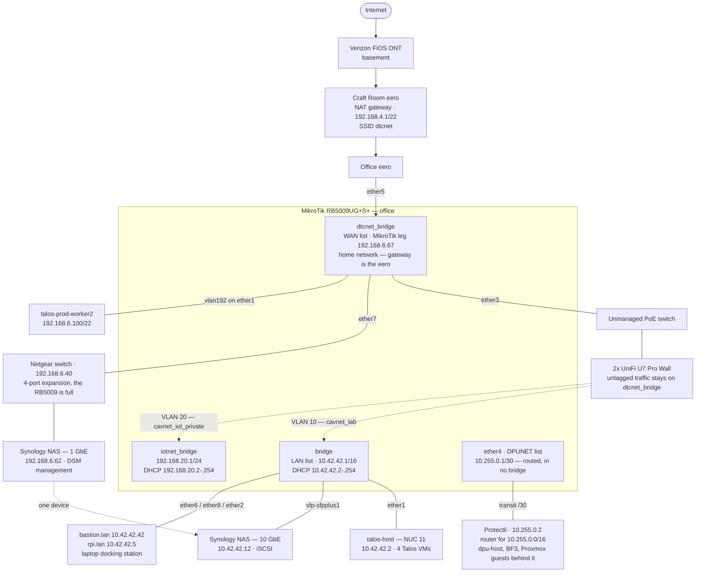
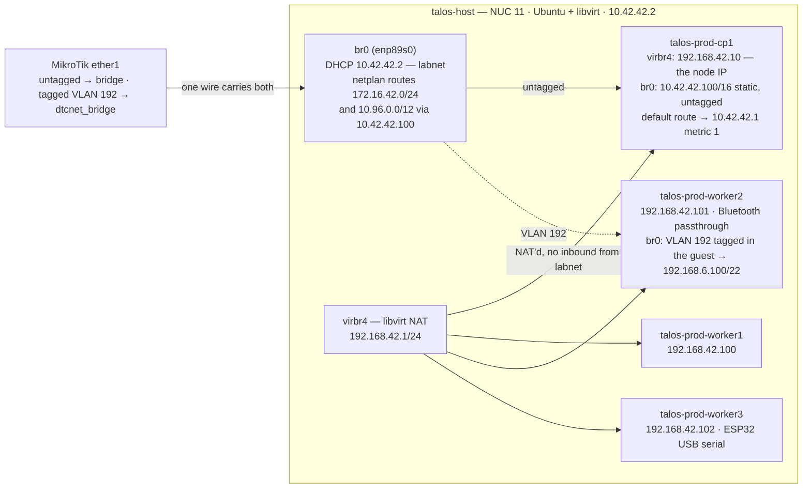
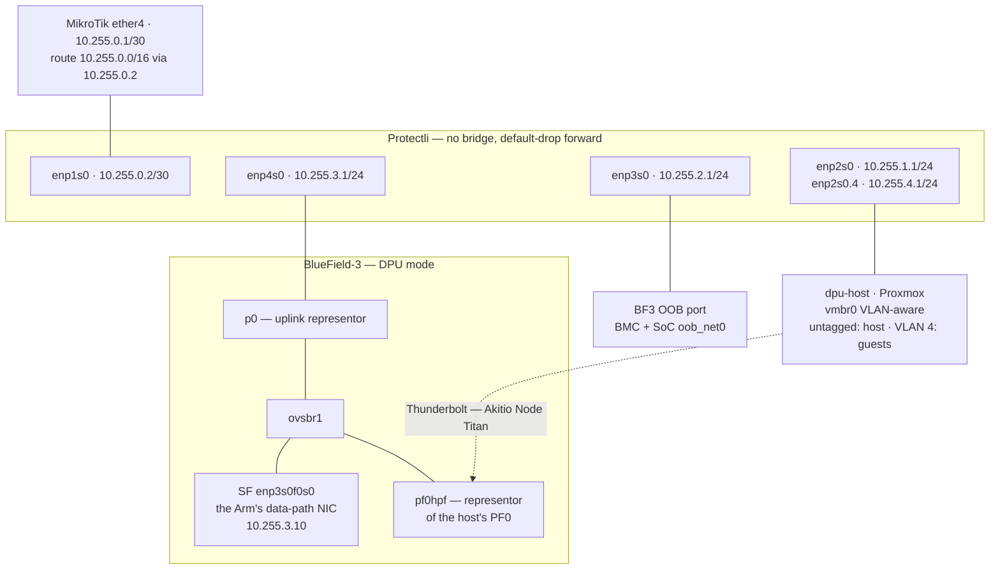
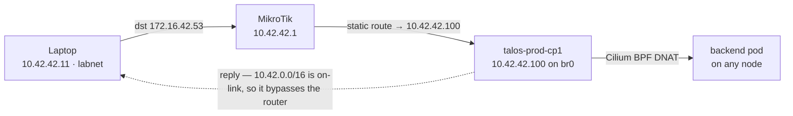
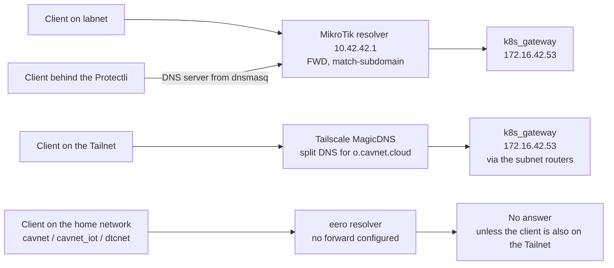
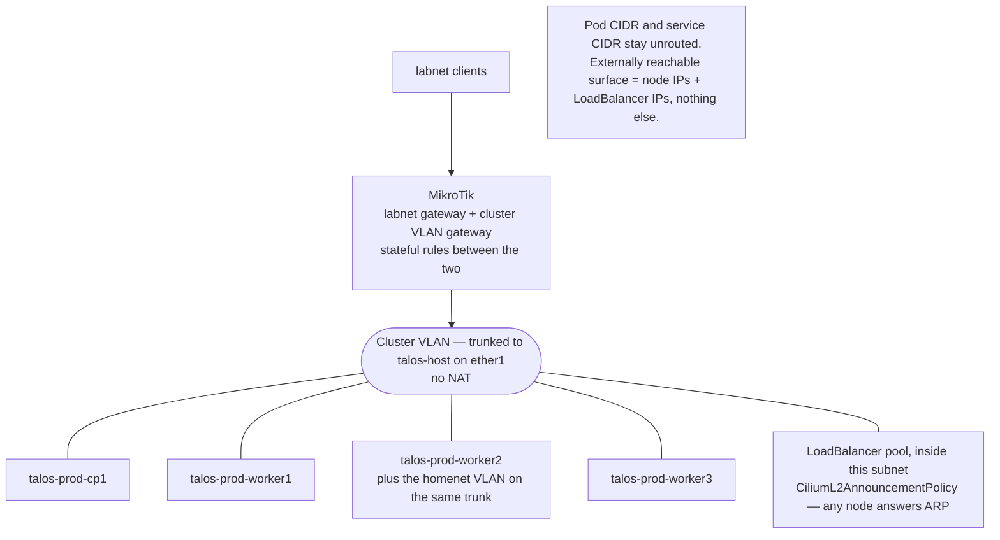

# Network architecture

Two parts. The sections up to [What is verified here](#what-is-verified-here-and-what-is-not)
describe the network as it runs on 2026-09-23, drawn from config rather than memory.
The sections headed **Proposed** describe designs that have not been built.

These are architecture, not migration plans: they state the target shape and the reasoning
behind it. Sequencing lives outside the repo. Work is tracked in DAN-24.

Read from: `mikrotik/config.rsc` (RouterOS export, 2026-09-23), the patches under
`k8s/talos/prod/patches/`, `k8s/talos/prod/README.md`, `k8s/talos/prod/cilium/`,
`ansible/host_vars/protectli.lan.yaml` and `ansible/roles/protectli/`, and the live systems. See [What is verified here](#what-is-verified-here-and-what-is-not) at the
end for the boundary.

## Networks

| Network | CIDR | Gateway | Lives on | Reachable from labnet |
| --- | --- | --- | --- | --- |
| home | `192.168.4.0/22` | `192.168.4.1` | Craft Room eero — its own NAT domain | Outbound only, via the MikroTik's masquerade |
| labnet | `10.42.0.0/16` | `10.42.42.1` | MikroTik `bridge` | — |
| IoT | `192.168.20.0/24` | `192.168.20.1` | MikroTik `iotnet_bridge` | Yes, connected route |
| Talos VMs | `192.168.42.0/24` | `192.168.42.1` | libvirt `virbr4` on talos-host | Yes, static route via `10.42.42.100` |
| LoadBalancer | `172.16.42.0/24` | none | Cilium LB-IPAM | Yes, static route via `10.42.42.100` |
| Service CIDR | `10.96.0.0/12` | none | Kubernetes | Yes, static route via `10.42.42.100` |
| DPU transit | `10.255.0.0/30` | — | MikroTik `ether4` ↔ Protectli `enp1s0` | Yes, connected |
| Host management | `10.255.1.0/24` | `10.255.1.1` | Protectli `enp2s0` | Admin hosts only |
| DPU management | `10.255.2.0/24` | `10.255.2.1` | Protectli `enp3s0` | Admin hosts only |
| DPU data path | `10.255.3.0/24` | `10.255.3.1` | Protectli `enp4s0` | Yes |
| Proxmox guests | `10.255.4.0/24` | `10.255.4.1` | Protectli `enp2s0.4`, VLAN 4 | Yes |

The five `10.255` networks sit behind one MikroTik summary route, `10.255.0.0/16` via
`10.255.0.2`. The Protectli firewalls them; see [Inside the Protectli](#inside-the-protectli).

Versions: MikroTik RB5009UG+S+ on RouterOS 7.14.1; Talos v1.13.9; Kubernetes v1.36.4;
Cilium v1.20.1.

## Wired topology

The home network is the odd one out: the MikroTik is a *client* of it, not its gateway.

`ether3` is a member of `dtcnet_bridge`, so the APs' untagged traffic lands on the home
network, while their VLAN 10 and VLAN 20 tags are pulled off into the other two bridges.
The Synology is one device with legs in two domains: 10 GbE on labnet for iSCSI, 1 GbE on
the home network for DSM management.

### MikroTik ports

| Port | Bridge | Attached |
| --- | --- | --- |
| `ether1` | `bridge`, plus `vlan192` → `dtcnet_bridge` | talos-host (NUC 11) |
| `ether2` | `bridge` | Laptop docking station |
| `ether3` | `dtcnet_bridge`, plus `vlan10` → `bridge` and `vlan20` → `iotnet_bridge` | PoE switch → 2× UniFi U7 Pro Wall |
| `ether4` | none — routed, `10.255.0.1/30`, list `DPUNET` | Protectli uplink (`enp1s0`, `10.255.0.2`) |
| `ether5` | `dtcnet_bridge` | Office eero — the uplink |
| `ether6` | `bridge` | RPi 4 — `bastion.lan` |
| `ether7` | `dtcnet_bridge` | Netgear switch — 4-port expansion; also carries the Synology's 1 GbE leg |
| `ether8` | `bridge` | RPi 5 — `rpi.lan` |
| `sfp-sfpplus1` | `bridge` | Synology NAS — 10 GbE |

### SSIDs

| SSID | Tag | Lands on | Notes |
| --- | --- | --- | --- |
| `dtcnet` | — | home | Hosted by the eeros. To be retired. |
| `cavnet` | untagged | home | UniFi. Intended replacement for `dtcnet`. |
| `cavnet_iot` | untagged | home | 2.4 GHz only. |
| `cavnet_lab` | VLAN 10 | labnet | |
| `cavnet_iot_private` | VLAN 20 | IoT | ESP32 devices. |

### Static reservations on the eero

| Address | Device |
| --- | --- |
| `192.168.5.208` | TP-Link Kasa KP303 — office strip feeding the BlueField-3, dpu-host and the MikroTik |
| `192.168.6.40` | Netgear switch management |
| `192.168.6.62` | Synology NAS — home network leg |
| `192.168.6.67` | MikroTik — home network leg |
| `192.168.6.100` | `talos-prod-worker2` — home network leg |

## Inside talos-host

The four Talos VMs sit on a libvirt NAT network with no inbound reachability. Two of them
have a second NIC on the host bridge, and those two legs are what make the rest of the
network work.

The VLAN 192 tag is applied inside worker2's guest, not by the host: `br0` is an ordinary
untagged bridge, and the tagged frames ride it out to `ether1`, where the MikroTik pulls
VLAN 192 into `dtcnet_bridge`. cp1's `10.42.42.100` leg exists because nothing on labnet
can reach a VM behind libvirt NAT otherwise.

talos-host also runs Tailscale as a subnet router, advertising `10.42.0.0/16`,
`10.96.0.0/12` and `172.16.42.0/24`, and as an exit node (`bin/tailscale-up`).

## Inside the Protectli

The Protectli (Ubuntu 24.04, four 1 GbE ports) routes a segment for the BlueField-3 DPU and
`dpu-host`. The DPU is treated as trusted networking infrastructure and the host as an
untrusted carrier of workloads. `terraform/defakto/main.tf` attests the BF3 against a pinned
TPM EK hash, so the host cannot forge the DPU's identity. The network's job is to stop the
host reaching the DPU's management plane. Everything below is rendered by
`ansible/roles/protectli` from `ansible/host_vars/protectli.lan.yaml`.

| Port | Address | Segment | Attached | Addressing |
| --- | --- | --- | --- | --- |
| `enp1s0` | `10.255.0.2/30` | Transit | MikroTik `ether4` | Static |
| `enp2s0` | `10.255.1.1/24` | Host management | `dpu-host` `vmbr0`, untagged | Reservation `.10` |
| `enp2s0.4` | `10.255.4.1/24` | Proxmox guests, VLAN 4 | Guests with `tag=4` (`cletus` at `.20`) | Pool `.100`–`.199` plus reservations |
| `enp3s0` | `10.255.2.1/24` | DPU management | BF3 BMC (`.10`) and SoC `oob_net0` (`.11`) — two MACs, one wire | Reservations |
| `enp4s0` | `10.255.3.1/24` | DPU data path | BF3 P0 | Reservation `.10`, no default route |

In DPU mode the card's ConnectX is a switch programmed from the Arm through OVS. `p0` is the
physical port as a switch port, not an endpoint. The endpoints on the data path are the Arm's
scalable function (`enp3s0f0s0`) and, later, the host's PF0 behind `pf0hpf`. `ovsbr2` does the
same for `p1`, which is not cabled. The SF gets no default route, so the SoC's own egress stays
on `oob_net0`.

### Why each segment is separate

Host management and DPU management are different subnets because ARP is not a boundary.
Putting the host's NIC on the same L2 as the DPU's management interfaces would make it
adjacent to the management plane of the device that polices it. Routing puts the Protectli in
the path, where a rule can refuse it.

The uplink is a two-host transit subnet, outside labnet's `/16`. Had the Protectli stayed on
labnet, it would hold a connected route to `10.42.0.0/16`. Replies to labnet would then skip
the MikroTik, which is the asymmetry described under
[How a LoadBalancer request reaches a pod](#how-a-loadbalancer-request-reaches-a-pod).

The guest VLAN is applied by Proxmox, so guest isolation is only as strong as the host. That
fits the trust model: a compromised host owns its guests anyway, and the boundary that must
hold against the host is DPU management, which is a separate physical port.

### Firewall

Two layers. The MikroTik treats `10.255.0.0/16` as one zone (`DPUNET`) and protects labnet from
it. The Protectli enforces per-segment rules in its own nftables table, `inet router`.

Protectli forward policy, new connections (established and related are always accepted):

| From ↓ / To → | Host mgmt | DPU mgmt | Data path | Guests | DNS `10.42.42.1:53` | Cluster LBs `:443` | Other RFC 1918 | Internet |
| --- | --- | --- | --- | --- | --- | --- | --- | --- |
| Admin hosts, via uplink | ✓ | ✓ | ✓ | ✓ | — | — | — | — |
| Other labnet or Tailnet | ✗ | ✗ | ✓ | ✓ | — | — | — | — |
| `dpu-host` | — | ✗ | ✗ | ✗ | ✓ | ✗ | ✗ | ✓ |
| BF3 SoC `10.255.2.11` | ✗ | — | ✗ | ✗ | ✓ | ✓ | ✗ | ✓ |
| BF3 BMC `10.255.2.10` | ✗ | ✗ | ✗ | ✗ | ✗ | ✗ | ✗ | ✗ |
| Data path | ✗ | ✗ | — | ✗ | ✓ | ✗ | ✗ | ✓ |
| Guests | ✗ | ✗ | ✗ | — | ✓ | ✗ | ✗ | ✓ |
| `tailscale0` (exit node) | ✗ | ✗ | ✗ | ✗ | ✓ | ✓ | ✗ | ✓ |

The admin hosts are `10.42.42.10`, `.11` and `.42` (`protectli_admin_hosts`). Tailnet clients
and worker pods both arrive as talos-host's `10.42.42.2`, so neither can be told apart from the
other; reach the management planes from the Tailnet by way of `bastion.lan`. Exit-node traffic
to other private ranges leaves as `10.255.0.2` and is dropped by the MikroTik's zone rules.

Details that are easy to break:

- **Docker** runs with `"ip-forward-no-drop": true`, so it no longer sets `FORWARD` to DROP.
  Every Docker DROP is scoped to its own bridges, and a drop in any table is final, so Docker
  can add drops but never open the router.
- **`nftables.service`** ships with `ExecStop=nft flush ruleset`, which would delete Docker's
  and Tailscale's tables. A drop-in replaces it with `nft destroy table inet router`, and
  `/etc/nftables.conf` replaces only its own table.
- **The input chain** is policy accept, with explicit drops from the downstream ports, so a
  mistake there cannot cut off SSH over the uplink or Tailscale.
- **Router advertisements** are ignored on the downstream ports (`accept-ra: false`), so an
  untrusted segment cannot become the Protectli's IPv6 gateway.

MikroTik `DPUNET` rules: the segment may reach the internet (non-RFC 1918 destinations only,
which keeps it off the home network), the LoadBalancers on TCP 80 and 443, and the MikroTik's
DNS. Labnet may initiate into it, and the Protectli applies the per-source rules. Everything
else in or out of `DPUNET` is dropped explicitly, because RouterOS accepts what falls off the
end of a chain.

### DHCP

dnsmasq on the Protectli serves DHCP only (`port=0`), and hands out `10.42.42.1` as the DNS
server, so the MikroTik stays the one resolver and the one authority for `*.lan`. `port=0`
must be in `/etc/dnsmasq.conf` itself. Debian's start hook greps that file for it before
registering `127.0.0.1` as the host's resolver. Every segment leases only to reserved MACs
except the guest VLAN, which also has a pool.

`ansible/roles/protectli/tests/run` renders the role and exercises the forward matrix and the
DHCP reservations in network namespaces inside a throwaway container. Run it after any change
to the role or its `host_vars`.

## How a LoadBalancer request reaches a pod

Not the way the config suggests. `l2announcements` is enabled in
`k8s/talos/prod/cilium/values.yaml`, but `kubectl get ciliuml2announcementpolicies -A`
returns nothing, so no node ever ARPs for a LoadBalancer IP. The traffic is carried
entirely by one static route.

The MikroTik never sees the return half. Conntrack marks the flow invalid, so
`/ip firewall raw` carries three `notrack` rules — one each for `172.16.42.0/24`,
`10.96.0.0/12` and `192.168.42.0/24`. The boundary cannot be filtered statefully, and
every LoadBalancer service in the cluster depends on cp1 being up.

Verified from a labnet host: `traceroute 172.16.42.53` shows one hop at `10.42.42.1` then
silence, `dig @172.16.42.53` answers, and `curl -k https://172.16.42.3` returns 200.

### LoadBalancer addresses in use

| Address | Service | Namespace |
| --- | --- | --- |
| `172.16.42.1` | `cilium-ingress` | `kube-system` |
| `172.16.42.2` | `mimir-http` | `monitoring` |
| `172.16.42.3` | `argocd-server` | `argocd` |
| `172.16.42.4` | `cilium-gateway-private-gateway` | `default` |
| `172.16.42.5` | `cilium-gateway-public-gateway` | `internet` |
| `172.16.42.6` | `loki-http` | `monitoring` |
| `172.16.42.7` | `matter-server` | `matter` |
| `172.16.42.8` | `firmware` | `firmware` |
| `172.16.42.9` | `flicd` | `flicd` |
| `172.16.42.12` | `mqtt` | `mosquitto` |
| `172.16.42.53` | `dns-gateway-k8s-gateway` | `dns-gateway` |

## Where `*.o.cavnet.cloud` resolves

Four client locations. Three reach the same answer by different paths; the home network
gets none.

Pods resolve through the Talos nameserver `10.42.42.1`
(`k8s/talos/prod/patches/common.patch.yaml`) — the same MikroTik forward as the first
row. The MikroTik forward is recent; before it, even labnet clients depended on Tailscale
DNS for these names.

The Protectli itself runs Tailscale with `accept-dns=false`. With it on, `systemd-resolved`
routed `~o.cavnet.cloud` to MagicDNS, which queries `172.16.42.53:53` directly. From the
Protectli's transit address, that query crosses the MikroTik's `DPUNET` zone, which allows only
TCP 80 and 443 to the LoadBalancer range. This setting lives on the host, not in this repo.

## What crosses the boundary today

Each of these is a thing the rearchitecture has to carry over or deliberately drop.

| From | To | For | Defined in |
| --- | --- | --- | --- |
| Cluster | `192.168.6.62` | Synology DSM management API | `k8s/manifests/synology-csi/dsm-proxy.yaml` |
| Cluster | `10.42.42.12` | iSCSI data over 10 GbE | `k8s/manifests/synology-csi/dsm-proxy.yaml` |
| Home network TVs | `192.168.6.100` | Jellyfin, exposed as a NodePort | `k8s/manifests/jellyfin/jellyfin.yaml` |
| UniFi APs | `192.168.6.100` | Controller, running `hostNetwork` on worker2 | `k8s/manifests/unifi/unifi-app.yaml` |
| HomePod Thread border router | `enp2s0.192` | ICMPv6 route advertisements for Matter | `k8s/talos/prod/patches/worker-dtcnet.patch.yaml` |
| All pods | `10.42.42.1` | DNS for `*.o.cavnet.cloud` and `*.lan` | `k8s/talos/prod/patches/common.patch.yaml` |
| MikroTik resolver | `172.16.42.53` | `o.cavnet.cloud` forward | `mikrotik/config.rsc` |
| Route53 | `10.42.42.100` | `k8s.cavnet.cloud` A record | AWS, outside this repo |
| Everything behind the Protectli | `10.42.42.1:53` | DNS | `ansible/roles/protectli/templates/`, `mikrotik/config.rsc` |
| BF3 SoC `10.255.2.11` | `172.16.42.0/24:443` | Cluster services; no telemetry runs on the BF3 today | `ansible/roles/protectli/templates/nftables.conf.j2` |
| Protectli host | `mimir`, `loki` on `:80` | Alloy, plain HTTP (no `enable_spiffe`) | `ansible/roles/docker/templates/docker/alloy/config.alloy.j2` |
| Tailnet | `10.255.0.0/16` | Subnet route via talos-host | `bin/tailscale-up` |

## Config that exists only because the VMs are NAT'd

Eight pieces of configuration, across four systems, all tracing back to one decision: the
Talos VMs sit on a libvirt NAT network, so one VM had to grow a leg on labnet and become
the cluster's router. This is the list to check off after the redesign.

1. **cp1's second NIC, statically addressed `10.42.42.100/16`** —
   `k8s/talos/prod/patches/cp.patch.yaml`
2. **cp1's default route via `10.42.42.1` at metric 1**, so replies to inbound traffic
   don't try to egress through the NAT — `k8s/talos/prod/patches/cp.patch.yaml`
3. **etcd pinned to advertise on `192.168.42.0/24`** —
   `k8s/talos/prod/patches/cp.patch.yaml`
4. **kubelet pinned to take its node IP from `192.168.42.0/24`** —
   `k8s/talos/prod/patches/common.patch.yaml`
5. **Three static routes on the MikroTik**, all pointing at `10.42.42.100` —
   `mikrotik/config.rsc`
6. **Three `notrack` rules on the MikroTik**, to stop conntrack dropping the asymmetric
   returns — `mikrotik/config.rsc`
7. **Two netplan routes on talos-host**, so the hypervisor can reach its own guests'
   service and LoadBalancer ranges — `k8s/talos/prod/README.md`
8. **A public Route53 A record holding a private address**, because `k8s.cavnet.cloud` has
   to resolve to the CP's labnet leg — AWS, outside this repo

Also vestigial: `l2announcements: enabled: true` in `k8s/talos/prod/cilium/values.yaml`
has no matching policy and does nothing. It carried over from the original MetalLB
install, whose `L2Advertisement` was equally inert — `172.16.42.0/24` has never been
on-link for any client, so nothing has ever ARPed for it.

## Known gaps

- **IoT can initiate into labnet.** `iotnet_bridge` belongs to neither `LAN` nor `WAN`, and
  RouterOS accepts what falls off the end of the forward chain.
- **One source address for two populations.** Tailnet clients (subnet-router SNAT) and worker
  pods (Cilium masquerade, then libvirt NAT) both arrive as `10.42.42.2`. Fixed by
  `--snat-subnet-routes=false` or by the cluster network redesign below.
- **`DPUNET` reaches every LoadBalancer on 80 and 443.** Tighten to specific addresses once
  the segment's cluster dependencies settle.
- **The Protectli fails open at boot.** If `nftables.service` fails, the kernel forwards
  between segments unfiltered. The ruleset is validated with `nft -c` before install and loads
  atomically.
- **The data-path SF's MAC may not survive a reimage.** `02:90:ef:4f:75:ed` is locally
  administered. If it changes, `dpu-p0`'s reservation stops matching.

## What is verified here, and what is not

Read from config or the live system:

- **MikroTik** — the RouterOS export at `mikrotik/config.rsc`, exported 2026-09-23.
- **Talos** — all five patches under `k8s/talos/prod/patches/` and the bootstrap README.
- **Cilium** — `k8s/talos/prod/cilium/values.yaml` and `resources.yaml`.
- **Live cluster** — `kubectl get nodes -o wide`, `kubectl get svc -A`, and
  `kubectl get ciliuml2announcementpolicies -A`, which returned no resources.
- **Reachability** — `traceroute`, `dig` and `curl` against LoadBalancer IPs from a laptop
  on labnet.
- **Protectli segment** — the forward matrix probed on 2026-09-23 from a laptop in the admin
  set, from `rpi.lan`, and from `dpu-host`. Every deny was paired with an allow of the same
  target from an admin host, so a closed port can't pass for a drop. The same matrix, and the
  DHCP reservations, run against the rendered config in `ansible/roles/protectli/tests/run`.

Taken on report, not inspected:

- **Both eeros.** Addressing, SSID config and reservations come from the DAN-24
  description, not from the devices.
- **The UniFi controller.** SSID-to-VLAN mapping is as described in the ticket; the
  controller's own config was not read.
- **Tailscale.** MagicDNS split-DNS settings live in the admin console. Only
  `bin/tailscale-up`, which covers talos-host, was read — what the RPis advertise is
  unconfirmed. The Protectli's own Tailscale settings (exit node, `accept-dns=false`) were
  set by hand.
- **The BF3's internal switch.** Which OVS bridge holds which port lives on the DPU, not in
  this repo. See [Inside the Protectli](#inside-the-protectli).
- **talos-host's netplan.** Taken from `k8s/talos/prod/README.md`, not from the host.
- **The Synology's 1 GbE leg on the Netgear switch.** Recorded from direct report. No
  config file here captures it.

## Proposed — workloads behind the DPU

**Not implemented.** The segment in [Inside the Protectli](#inside-the-protectli) exists;
workloads on it do not. `cletus` runs on the guest VLAN, which the host enforces, not behind
the DPU.

### What is open

Whether workloads reach the data path through the host's PF0 (behind `pf0hpf` in `ovsbr1`),
through DPU-managed virtual interfaces, or through an overlay is not decided. With one DPU and
one host there is no fabric to span, so the Protectli is designed not to care: `10.255.3.0/24`
is plain routed transport either way, and a VTEP subnet can be added later without touching
the router. PF0 currently fails to probe on `dpu-host` (`mlx5_core ... error -110`); PF1
probes.

### Exposing workloads

Reuse the cluster rather than building a second ingress. `k8s/manifests/synology-csi/dsm-proxy.yaml`
already demonstrates the pattern: a selectorless Service plus a hand-written EndpointSlice
pointing at an off-cluster address, then an HTTPRoute on the private gateway. The same shape
points at a workload's address on the data path subnet and inherits the wildcard
`*.o.cavnet.cloud` certificate, DNS from k8s_gateway, reachability from labnet and the
Tailnet, PocketID for auth, and the Cloudflare tunnel for anything that should be public.

The cost is path length — every request crosses the cluster and traverses cp1. That
bottleneck is cp1's single labnet leg, which the cluster network redesign below removes. The
Protectli would also need a rule admitting the cluster to the workload's port.

### Constraints worth knowing

A B3220's ports are 200GbE class and a Protectli port is not, so workload traffic is capped
at 1 Gb. Fine for a chat stream, painful for pulling model weights off the NAS. The answer
if it bites is not a bigger Protectli — it is the SFP+ ports on a future basement router,
giving P1 a path that skips this box entirely.

The Thunderbolt link is a second ceiling. It trains at PCIe x1, 2.5 GT/s (2 Gb/s), and the
kernel reports insufficient slot power (27 W).

The Protectli is full: transit, host management, DPU management and P0 use all four ports.

## Proposed — Kubernetes cluster network

**Not implemented.**

The problem is stated above under
[Config that exists only because the VMs are NAT'd](#config-that-exists-only-because-the-vms-are-natd):
eight pieces of configuration across four systems, a control-plane VM that every LoadBalancer
service depends on, and a boundary that cannot be filtered statefully. The original goal —
keep the cluster network private and poke narrow holes — was sound. Hypervisor NAT is the
wrong mechanism for it, because NAT is an addressing workaround that blocks inbound traffic
as a side effect rather than as policy. The moment you need a hole, a host has to sit in both
worlds and becomes a router the firewall cannot see around.

Measured against that goal, the current arrangement isolates nothing: labnet holds routes to
`192.168.42.0/24`, `172.16.42.0/24` and `10.96.0.0/12`, and nothing enforces anything at the
boundary. A flat network with one stateful rule would isolate more.

### Shape

Cluster nodes move to their own VLAN on the MikroTik. No libvirt NAT network.

- A VLAN on `ether1` carries the cluster network. The MikroTik holds the gateway address.
- On talos-host, a VLAN sub-interface and a bridge for it, with **no IP on the host** — the
  hypervisor does not need an address in the VM network. Its own management stays untagged
  on labnet.
- Each VM gets one NIC on that bridge. cp1 loses its second leg.
- The Cilium LoadBalancer pool moves **inside the cluster VLAN's subnet**, and a
  `CiliumL2AnnouncementPolicy` is added. The MikroTik then ARPs for LoadBalancer IPs on that
  VLAN and any node can answer. No static route, no single point of failure at cp1.
- Routing is symmetric, because labnet clients reach LoadBalancer IPs through the MikroTik
  and the nodes' default gateway is the MikroTik. All three `notrack` rules go away.

### Where the boundary lives

Three layers, each doing what it is good at.

The **router** does subnet-level policy. The cluster VLAN is a zone with a stateful ruleset
that is readable, auditable and versioned in `mikrotik/config.rsc` — roughly ten rules
replacing three static routes and three `notrack` rules:

- labnet to cluster VLAN: the LoadBalancer range; plus 6443 and 50000 to node IPs from a
  workstation.
- cluster VLAN to labnet: the NAS on 3260 and 5000, the MikroTik on 53, NTP.
- cluster VLAN to the internet: allow.
- default: drop.

**Cilium** does workload-level policy. `CiliumNetworkPolicy` is where narrow holes belong for
anything finer than a subnet, and Hubble shows what a policy actually drops.

**The pod and service CIDRs stay unrouted.** That is the real private cluster network, and it
is what the original goal was reaching for. Nothing outside needs a route to `10.96.0.0/12`.
Dropping `bpf.lbExternalClusterIP: true` removes a route, a `notrack` rule, and the exposure
of every ClusterIP in the cluster to labnet and the whole Tailnet.

### Addressing

The clean version shrinks labnet from `10.42.42.1/16` to a `/24` and gives the cluster VLAN
an adjacent `/24`, so Tailscale keeps advertising a single `10.42.0.0/16`. That changes every
labnet host's netmask, so it belongs with the homenet rearchitecture rather than before it.
Moving the cluster first is possible using a subnet outside the `/16`, at the cost of one more
Tailscale route.

Node addresses should be static in the Talos machine config rather than DHCP reservations —
etcd members should not depend on the router being up to get an address at boot. That departs
from how everything else here is addressed, which is the argument against it.

### Side benefit

Once `ether1` is a trunk carrying the cluster VLAN, adding the homenet VLAN to it is free.
Any node can have a leg on homenet and worker2 stops being a snowflake. That shrinks the
dtcnet problem to the two workloads that genuinely need L2 there — Matter, which must receive
ICMPv6 router advertisements from the Thread border router, and Home Assistant, which needs
mDNS and SSDP discovery. The UniFi controller can adopt over routing via DHCP option 43 or
`set-inform`, and Jellyfin becomes an ordinary LoadBalancer service instead of a NodePort.

### Verify, do not assume

Dropping the libvirt NAT network should also drop the `LIBVIRT_FWI` and `LIBVIRT_FWO` rules
and libvirt's reason for loading `br_netfilter`. Given that the Protectli's bridge forwarded
only while `br_netfilter` was unloaded, check `lsmod | grep br_netfilter` on talos-host after
the change and confirm the new bridge forwards.

This is a rebuild of the cluster's addressing, not an edit. Node IPs, etcd peer addresses, the
control-plane endpoint and the `k8s.cavnet.cloud` record all move together.
