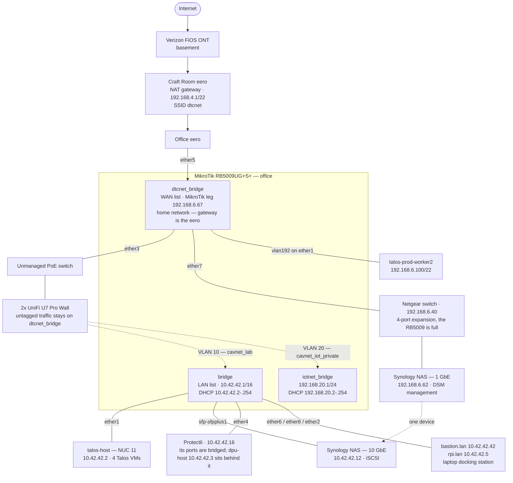
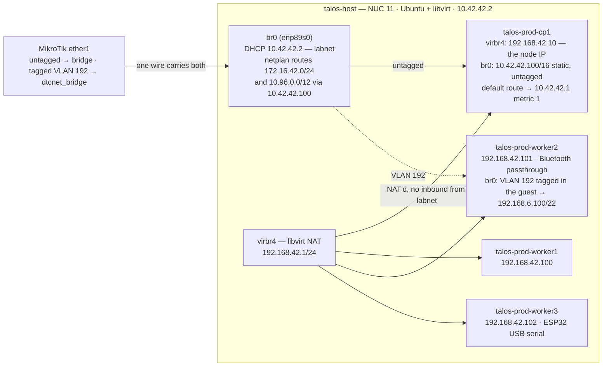
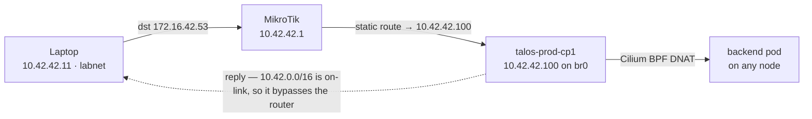
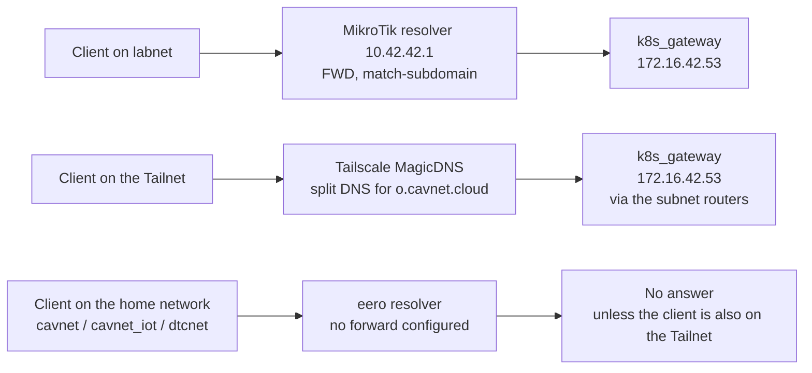
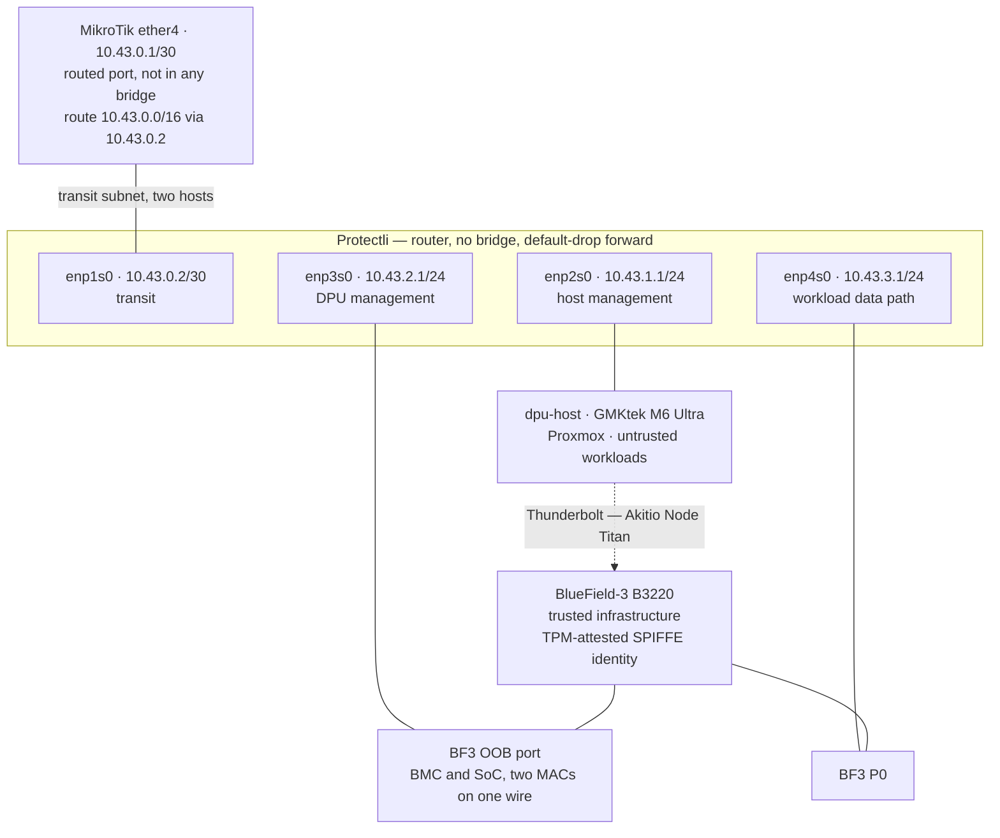

# Network architecture

Two parts. The sections up to [What is verified here](#what-is-verified-here-and-what-is-not)
describe the network as it runs on 2026-09-22, drawn from config rather than memory.
The sections headed **Proposed** describe designs that have not been built.

These are architecture, not migration plans: they state the target shape and the reasoning
behind it. Sequencing lives outside the repo. Work is tracked in DAN-24.

Read from: `mikrotik/config.rsc` (RouterOS export, 2026-09-21), the patches under
`k8s/talos/prod/patches/`, `k8s/talos/prod/README.md`, `k8s/talos/prod/cilium/`, and the
live cluster. See [What is verified here](#what-is-verified-here-and-what-is-not) at the
end for the boundary.

## Networks

| Network | CIDR | Gateway | Lives on | Reachable from labnet |
| --- | --- | --- | --- | --- |
| home | `192.168.4.0/22` | `192.168.4.1` | Craft Room eero — its own NAT domain | Outbound only, via the MikroTik's masquerade |
| labnet | `10.42.0.0/16` | `10.42.42.1` | MikroTik `bridge` | — |
| IoT | `192.168.20.0/24` | `192.168.20.1` | MikroTik `iotnet_bridge` | Yes, connected route |
| Talos VMs | `192.168.42.0/24` | `192.168.42.1` | libvirt `virbr4` on talos-host | Yes, static route via `10.42.42.100` |
| LoadBalancer | `172.16.42.0/24` | none | Cilium LB-IPAM | Yes, static route via `10.42.42.100` |
| Service CIDR | `10.96.0.0/12` | none | Kubernetes | Yes, static route via `10.42.42.100` |

Versions: MikroTik RB5009UG+S+ on RouterOS 7.14.1; Talos v1.13.9; Kubernetes v1.36.4;
Cilium v1.20.1.

## Wired topology

The home network is the odd one out: the MikroTik is a *client* of it, not its gateway.

`ether3` is a member of `dtcnet_bridge`, so the APs' untagged traffic lands on the home
network, while their VLAN 10 and VLAN 20 tags are pulled off into the other two bridges.
The Synology is one device with legs in two domains: 10 GbE on labnet for iSCSI, 1 GbE on
the home network for DSM management.

### MikroTik ports

| Port | Bridge | Attached |
| --- | --- | --- |
| `ether1` | `bridge`, plus `vlan192` → `dtcnet_bridge` | talos-host (NUC 11) |
| `ether2` | `bridge` | Laptop docking station |
| `ether3` | `dtcnet_bridge`, plus `vlan10` → `bridge` and `vlan20` → `iotnet_bridge` | PoE switch → 2× UniFi U7 Pro Wall |
| `ether4` | `bridge` | Protectli — its own ports are bridged together, so dpu-host (`10.42.42.3`) sits behind it on the same L2 |
| `ether5` | `dtcnet_bridge` | Office eero — the uplink |
| `ether6` | `bridge` | RPi 4 — `bastion.lan` |
| `ether7` | `dtcnet_bridge` | Netgear switch — 4-port expansion; also carries the Synology's 1 GbE leg |
| `ether8` | `bridge` | RPi 5 — `rpi.lan` |
| `sfp-sfpplus1` | `bridge` | Synology NAS — 10 GbE |

### SSIDs

| SSID | Tag | Lands on | Notes |
| --- | --- | --- | --- |
| `dtcnet` | — | home | Hosted by the eeros. To be retired. |
| `cavnet` | untagged | home | UniFi. Intended replacement for `dtcnet`. |
| `cavnet_iot` | untagged | home | 2.4 GHz only. |
| `cavnet_lab` | VLAN 10 | labnet | |
| `cavnet_iot_private` | VLAN 20 | IoT | ESP32 devices. |

### Static reservations on the eero

| Address | Device |
| --- | --- |
| `192.168.5.208` | TP-Link Kasa KP303 — office strip feeding the BlueField-3, dpu-host and the MikroTik |
| `192.168.6.40` | Netgear switch management |
| `192.168.6.62` | Synology NAS — home network leg |
| `192.168.6.67` | MikroTik — home network leg |
| `192.168.6.100` | `talos-prod-worker2` — home network leg |

## Inside talos-host

The four Talos VMs sit on a libvirt NAT network with no inbound reachability. Two of them
have a second NIC on the host bridge, and those two legs are what make the rest of the
network work.

The VLAN 192 tag is applied inside worker2's guest, not by the host: `br0` is an ordinary
untagged bridge, and the tagged frames ride it out to `ether1`, where the MikroTik pulls
VLAN 192 into `dtcnet_bridge`. cp1's `10.42.42.100` leg exists because nothing on labnet
can reach a VM behind libvirt NAT otherwise.

talos-host also runs Tailscale as a subnet router, advertising `10.42.0.0/16`,
`10.96.0.0/12` and `172.16.42.0/24`, and as an exit node (`bin/tailscale-up`).

## How a LoadBalancer request reaches a pod

Not the way the config suggests. `l2announcements` is enabled in
`k8s/talos/prod/cilium/values.yaml`, but `kubectl get ciliuml2announcementpolicies -A`
returns nothing, so no node ever ARPs for a LoadBalancer IP. The traffic is carried
entirely by one static route.

The MikroTik never sees the return half. Conntrack marks the flow invalid, so
`/ip firewall raw` carries three `notrack` rules — one each for `172.16.42.0/24`,
`10.96.0.0/12` and `192.168.42.0/24`. The boundary cannot be filtered statefully, and
every LoadBalancer service in the cluster depends on cp1 being up.

Verified from a labnet host: `traceroute 172.16.42.53` shows one hop at `10.42.42.1` then
silence, `dig @172.16.42.53` answers, and `curl -k https://172.16.42.3` returns 200.

### LoadBalancer addresses in use

| Address | Service | Namespace |
| --- | --- | --- |
| `172.16.42.1` | `cilium-ingress` | `kube-system` |
| `172.16.42.2` | `mimir-http` | `monitoring` |
| `172.16.42.3` | `argocd-server` | `argocd` |
| `172.16.42.4` | `cilium-gateway-private-gateway` | `default` |
| `172.16.42.5` | `cilium-gateway-public-gateway` | `internet` |
| `172.16.42.6` | `loki-http` | `monitoring` |
| `172.16.42.7` | `matter-server` | `matter` |
| `172.16.42.8` | `firmware` | `firmware` |
| `172.16.42.9` | `flicd` | `flicd` |
| `172.16.42.12` | `mqtt` | `mosquitto` |
| `172.16.42.53` | `dns-gateway-k8s-gateway` | `dns-gateway` |

## Where `*.o.cavnet.cloud` resolves

Three client locations, three different paths to the same answer — except the home
network, which has none.

Pods resolve through the Talos nameserver `10.42.42.1`
(`k8s/talos/prod/patches/common.patch.yaml`) — the same MikroTik forward as the first
row. The MikroTik forward is recent; before it, even labnet clients depended on Tailscale
DNS for these names.

## What crosses the boundary today

Each of these is a thing the rearchitecture has to carry over or deliberately drop.

| From | To | For | Defined in |
| --- | --- | --- | --- |
| Cluster | `192.168.6.62` | Synology DSM management API | `k8s/manifests/synology-csi/dsm-proxy.yaml` |
| Cluster | `10.42.42.12` | iSCSI data over 10 GbE | `k8s/manifests/synology-csi/dsm-proxy.yaml` |
| Home network TVs | `192.168.6.100` | Jellyfin, exposed as a NodePort | `k8s/manifests/jellyfin/jellyfin.yaml` |
| UniFi APs | `192.168.6.100` | Controller, running `hostNetwork` on worker2 | `k8s/manifests/unifi/unifi-app.yaml` |
| HomePod Thread border router | `enp2s0.192` | ICMPv6 route advertisements for Matter | `k8s/talos/prod/patches/worker-dtcnet.patch.yaml` |
| All pods | `10.42.42.1` | DNS for `*.o.cavnet.cloud` and `*.lan` | `k8s/talos/prod/patches/common.patch.yaml` |
| MikroTik resolver | `172.16.42.53` | `o.cavnet.cloud` forward | `mikrotik/config.rsc` |
| Route53 | `10.42.42.100` | `k8s.cavnet.cloud` A record | AWS, outside this repo |

## Config that exists only because the VMs are NAT'd

Eight pieces of configuration, across four systems, all tracing back to one decision: the
Talos VMs sit on a libvirt NAT network, so one VM had to grow a leg on labnet and become
the cluster's router. This is the list to check off after the redesign.

1. **cp1's second NIC, statically addressed `10.42.42.100/16`** —
   `k8s/talos/prod/patches/cp.patch.yaml`
2. **cp1's default route via `10.42.42.1` at metric 1**, so replies to inbound traffic
   don't try to egress through the NAT — `k8s/talos/prod/patches/cp.patch.yaml`
3. **etcd pinned to advertise on `192.168.42.0/24`** —
   `k8s/talos/prod/patches/cp.patch.yaml`
4. **kubelet pinned to take its node IP from `192.168.42.0/24`** —
   `k8s/talos/prod/patches/common.patch.yaml`
5. **Three static routes on the MikroTik**, all pointing at `10.42.42.100` —
   `mikrotik/config.rsc`
6. **Three `notrack` rules on the MikroTik**, to stop conntrack dropping the asymmetric
   returns — `mikrotik/config.rsc`
7. **Two netplan routes on talos-host**, so the hypervisor can reach its own guests'
   service and LoadBalancer ranges — `k8s/talos/prod/README.md`
8. **A public Route53 A record holding a private address**, because `k8s.cavnet.cloud` has
   to resolve to the CP's labnet leg — AWS, outside this repo

Also vestigial: `l2announcements: enabled: true` in `k8s/talos/prod/cilium/values.yaml`
has no matching policy and does nothing. It carried over from the original MetalLB
install, whose `L2Advertisement` was equally inert — `172.16.42.0/24` has never been
on-link for any client, so nothing has ever ARPed for it.

## What is verified here, and what is not

Read from config or the live system:

- **MikroTik** — the RouterOS export at `mikrotik/config.rsc`, exported 2026-09-21.
- **Talos** — all five patches under `k8s/talos/prod/patches/` and the bootstrap README.
- **Cilium** — `k8s/talos/prod/cilium/values.yaml` and `resources.yaml`.
- **Live cluster** — `kubectl get nodes -o wide`, `kubectl get svc -A`, and
  `kubectl get ciliuml2announcementpolicies -A`, which returned no resources.
- **Reachability** — `traceroute`, `dig` and `curl` against LoadBalancer IPs from a laptop
  on labnet.

Taken on report, not inspected:

- **Both eeros.** Addressing, SSID config and reservations come from the DAN-24
  description, not from the devices.
- **The UniFi controller.** SSID-to-VLAN mapping is as described in the ticket; the
  controller's own config was not read.
- **Tailscale.** MagicDNS split-DNS settings live in the admin console. Only
  `bin/tailscale-up`, which covers talos-host, was read — what the RPis advertise is
  unconfirmed.
- **talos-host's netplan.** Taken from `k8s/talos/prod/README.md`, not from the host.
- **Two physical placements.** The Synology's 1 GbE leg on the Netgear switch, and
  dpu-host behind the Protectli, are recorded from direct report. No config file here
  captures either one.

## Proposed — Protectli / BF3 segment

**Not implemented.** Today the Protectli bridges all four ports into `br0`
(`ansible/roles/protectli/files/netplan.yaml`) and acts as a switch on labnet.

Purpose: a routed, firewalled segment for the BlueField-3 DPU and `dpu-host`, treating the
DPU as trusted networking infrastructure and the host as an untrusted carrier of workloads.
Half the trust model already exists — `terraform/defakto/main.tf` attests the BF3 against a
pinned TPM EK public-key hash and issues SVIDs pathed by `tpm_ek.public_hash`, so the DPU's
identity is rooted in its own TPM and the host cannot forge it. The network design has to
preserve that, which means the host must not reach the DPU's management plane.

### Shape

The Protectli becomes a router with four routed ports and no bridge.

| Port | Segment | Address | Holds |
| --- | --- | --- | --- |
| `enp1s0` | transit to the MikroTik | `10.43.0.2/30` | uplink only, no hosts |
| `enp2s0` | host management | `10.43.1.1/24` | `dpu-host` |
| `enp3s0` | DPU management | `10.43.2.1/24` | BF3 BMC and SoC `oob_net0` — two MACs, one wire |
| `enp4s0` | workload data path | `10.43.3.1/24` | BF3 P0 |

The whole segment lives in `10.43.0.0/16`, so the MikroTik needs one summary route and
Tailscale one more advertisement. It sits outside `10.42.0.0/16` deliberately: labnet hosts
carry a `/16` mask, so anything numbered inside that range looks on-link to them and never
reaches a router.

### Why host management and DPU management are separate subnets

Putting `dpu-host`'s physical NIC on the same network as the DPU's OOB interfaces would
make an untrusted host L2-adjacent to the management plane of the device policing it, and
ARP is not a boundary. Separate subnets put the Protectli in the path, where a rule can
state that host management may not initiate to DPU management.

Routing also dissolves the reason port 4 is unplugged today. Separate L3 segments mean
separate DHCP scopes, so the OOB interfaces and the dataport stop competing for one
broadcast domain.

### Why the uplink gets its own transit subnet

`ether4` comes out of `bridge` on the MikroTik and becomes an L3 port. Without this, the
Protectli's uplink stays on labnet at `10.42.42.16/16` and therefore holds a directly
connected route to `10.42.0.0/16`. Replies to labnet clients would match that connected
route and go straight back over L2, bypassing the MikroTik — the same asymmetry documented
under [How a LoadBalancer request reaches a pod](#how-a-loadbalancer-request-reaches-a-pod),
and the same `notrack` workaround.

A dedicated two-host subnet removes the connected route. Replies fall through to the default
route, return via the MikroTik, and conntrack stays intact. It also makes ICMP redirects
impossible, so the path stops depending on whether a given client honors them.

### What changes

- `ansible/roles/protectli/files/netplan.yaml` — four static `ethernets`, no bridge. The
  `macaddress` pin on `br0` exists only so the MikroTik's DHCP reservation matches, and goes
  away with it.
- Protectli gains `net.ipv4.ip_forward`, an `nftables` ruleset with a default-drop forward
  policy, and `dnsmasq` for DHCP and DNS on the three downstream segments, forwarding
  `o.cavnet.cloud` to `172.16.42.53` the way the MikroTik does.
- `mikrotik/config.rsc` — remove `ether4` from `bridge`, address it `10.43.0.1/30`, add the
  summary route, drop the Protectli's DHCP reservation and the `protectli.lan` static DNS
  entry, and move `dpu-host.lan` to its new address.

### The firewall is the real work

The defconf ruleset is built entirely around the `LAN` and `WAN` interface lists. A routed
port belongs to neither, and both chains misbehave as a result.

The input chain drops anything not arriving from `LAN`, so the segment loses access to the
MikroTik's own services including DNS. Adding `ether4` to `LAN` would hand the DPU segment
the same trust as labnet and defeat the purpose, so it needs explicit input rules instead —
the existing rule permitting UDP/53 from the ESP32 network is the template.

The forward chain only drops new connections arriving from `WAN`. RouterOS has no
configurable chain policy, so traffic falling off the end of a chain is accepted, and a
routed `ether4` would get unrestricted forward access to labnet by default. The new zone
needs its own ruleset.

### Exposing workloads

Reuse the cluster rather than building a second ingress. `k8s/manifests/synology-csi/dsm-proxy.yaml`
already demonstrates the pattern: a selectorless Service plus a hand-written EndpointSlice
pointing at an off-cluster address, then an HTTPRoute on the private gateway. The same shape
points at a workload's address on the data path subnet and inherits the wildcard
`*.o.cavnet.cloud` certificate, DNS from k8s_gateway, reachability from labnet and the
Tailnet, PocketID for auth, and the Cloudflare tunnel for anything that should be public.

The cost is path length — every request crosses the cluster and traverses cp1. That
bottleneck is cp1's single labnet leg, which the cluster network redesign below removes.

This requires stable addresses on the data path subnet, so use reservations or statics
rather than a dynamic pool.

### Constraints worth knowing

A B3220's ports are 200GbE class and a Protectli port is not, so workload traffic is capped
at 1 Gb. Fine for a chat stream, painful for pulling model weights off the NAS. The answer
if it bites is not a bigger Protectli — it is the SFP+ ports on a future basement router,
giving P1 a path that skips this box entirely.

With transit, host management, DPU management and P0 assigned, the Protectli is full. The
second dataport has nowhere to land in this topology.

`br_netfilter` stops mattering once `br0` is gone. No bridge, no question about whether
bridged frames traverse `FORWARD`.

### Deliberately left open

Whether workloads sit directly on `10.43.3.0/24` or behind DPU-managed virtual interfaces,
and whether any overlay is involved, is not decided here. With one DPU and one host there is
no fabric to span, so the Protectli is designed not to care: `10.43.3.0/24` is plain routed
transport either way, and a VTEP subnet can be added later without touching the router.

How the DPU presents virtual interfaces to Proxmox over Thunderbolt is unverified and is the
point of the experiment.

## Proposed — Kubernetes cluster network

**Not implemented.**

The problem is stated above under
[Config that exists only because the VMs are NAT'd](#config-that-exists-only-because-the-vms-are-natd):
eight pieces of configuration across four systems, a control-plane VM that every LoadBalancer
service depends on, and a boundary that cannot be filtered statefully. The original goal —
keep the cluster network private and poke narrow holes — was sound. Hypervisor NAT is the
wrong mechanism for it, because NAT is an addressing workaround that blocks inbound traffic
as a side effect rather than as policy. The moment you need a hole, a host has to sit in both
worlds and becomes a router the firewall cannot see around.

Measured against that goal, the current arrangement isolates nothing: labnet holds routes to
`192.168.42.0/24`, `172.16.42.0/24` and `10.96.0.0/12`, and nothing enforces anything at the
boundary. A flat network with one stateful rule would isolate more.

### Shape

Cluster nodes move to their own VLAN on the MikroTik. No libvirt NAT network.

- A VLAN on `ether1` carries the cluster network. The MikroTik holds the gateway address.
- On talos-host, a VLAN sub-interface and a bridge for it, with **no IP on the host** — the
  hypervisor does not need an address in the VM network. Its own management stays untagged
  on labnet.
- Each VM gets one NIC on that bridge. cp1 loses its second leg.
- The Cilium LoadBalancer pool moves **inside the cluster VLAN's subnet**, and a
  `CiliumL2AnnouncementPolicy` is added. The MikroTik then ARPs for LoadBalancer IPs on that
  VLAN and any node can answer. No static route, no single point of failure at cp1.
- Routing is symmetric, because labnet clients reach LoadBalancer IPs through the MikroTik
  and the nodes' default gateway is the MikroTik. All three `notrack` rules go away.

### Where the boundary lives

Three layers, each doing what it is good at.

The **router** does subnet-level policy. The cluster VLAN is a zone with a stateful ruleset
that is readable, auditable and versioned in `mikrotik/config.rsc` — roughly ten rules
replacing three static routes and three `notrack` rules:

- labnet to cluster VLAN: the LoadBalancer range; plus 6443 and 50000 to node IPs from a
  workstation.
- cluster VLAN to labnet: the NAS on 3260 and 5000, the MikroTik on 53, NTP.
- cluster VLAN to the internet: allow.
- default: drop.

**Cilium** does workload-level policy. `CiliumNetworkPolicy` is where narrow holes belong for
anything finer than a subnet, and Hubble shows what a policy actually drops.

**The pod and service CIDRs stay unrouted.** That is the real private cluster network, and it
is what the original goal was reaching for. Nothing outside needs a route to `10.96.0.0/12`.
Dropping `bpf.lbExternalClusterIP: true` removes a route, a `notrack` rule, and the exposure
of every ClusterIP in the cluster to labnet and the whole Tailnet.

### Addressing

The clean version shrinks labnet from `10.42.42.1/16` to a `/24` and gives the cluster VLAN
an adjacent `/24`, so Tailscale keeps advertising a single `10.42.0.0/16`. That changes every
labnet host's netmask, so it belongs with the homenet rearchitecture rather than before it.
Moving the cluster first is possible using a subnet outside the `/16`, at the cost of one more
Tailscale route.

Node addresses should be static in the Talos machine config rather than DHCP reservations —
etcd members should not depend on the router being up to get an address at boot. That departs
from how everything else here is addressed, which is the argument against it.

### Side benefit

Once `ether1` is a trunk carrying the cluster VLAN, adding the homenet VLAN to it is free.
Any node can have a leg on homenet and worker2 stops being a snowflake. That shrinks the
dtcnet problem to the two workloads that genuinely need L2 there — Matter, which must receive
ICMPv6 router advertisements from the Thread border router, and Home Assistant, which needs
mDNS and SSDP discovery. The UniFi controller can adopt over routing via DHCP option 43 or
`set-inform`, and Jellyfin becomes an ordinary LoadBalancer service instead of a NodePort.

### Verify, do not assume

Dropping the libvirt NAT network should also drop the `LIBVIRT_FWI` and `LIBVIRT_FWO` rules
and libvirt's reason for loading `br_netfilter`. Given that the Protectli's bridge forwarded
only while `br_netfilter` was unloaded, check `lsmod | grep br_netfilter` on talos-host after
the change and confirm the new bridge forwards.

This is a rebuild of the cluster's addressing, not an edit. Node IPs, etcd peer addresses, the
control-plane endpoint and the `k8s.cavnet.cloud` record all move together.
